# Rangkuman Komprehensif & Terstruktur Skripsi Vico Pratama (2025)
## "Analisis Data Satelit Historis untuk Memantau Vegetasi Terkait dengan Perubahan Iklim"
### AI-Optimized Knowledge Base & Methodological Specification

---

## 1. Metadata Dokumen & Konteks Penelitian
- **Penulis**: Vico Pratama (NPM: 6182101011)
- **Pembimbing**: Tim Dosen Program Studi Informatika, Fakultas Sains, Universitas Katolik Parahyangan, Bandung
- **Tahun**: 2025 (Revisi Final: 291 Halaman)
- **Komoditas & Wilayah Asli**: Padi Varietas **Pandanwangi** di 7 Kecamatan Kabupaten Cianjur (Warungkondang, Gekbrong, Cugenang, Cianjur, Campaka, Cilaku, Cibeber).
- **Target Adaptasi Baru**: Padi Varietas **Rojolele Srinuk** di Delanggu & Tulung, Kabupaten Klaten, Jawa Tengah.
- **Tujuan Utama Penelitian**:
  1. Mengembangkan pipeline fusi citra multi-sensor (**Sentinel-2** dan **Landsat 5/7/8**) untuk membangun deret waktu jangka panjang (1988–2025).
  2. Menerapkan segmentasi superpixel **SNIC (Simple Non-Iterative Clustering)** untuk mereduksi kompleksitas komputasi piksel sebesar ~97% sekaligus mempertahankan integritas batas spasial petak sawah.
  3. Mengklasifikasikan lahan sawah dan varietas padi spesifik menggunakan **KNN dengan metrik jarak Dynamic Time Warping (DTW)** secara hierarkis dua tahap.
  4. Menganalisis keterkaitan faktor iklim harian (**ERA5-Land**, **CHIRTS**) terhadap fenologi padi melalui *cross-correlation* dengan jeda waktu (*time lag*).

---

## 2. Arsitektur Pipeline Metodologi End-to-End

```mermaid
flowchart TD
    subgraph S1_Ingestion ["1. Akuisisi & Fusi Multi-Sensor Citra Satelit"]
        S2["Sentinel-2 SR Harmonized\n(10m, 2017-2025)\nBand: B2, B3, B4, B8"]
        L8["Landsat 8 OLI L2\n(30m, 2013-2025)\nBand: SR_B2, B3, B4, B5"]
        L7["Landsat 7 ETM+ L2\n(30m, 1999-2025)\nBand: SR_B1, B2, B3, B4"]
        L5["Landsat 5 TM L2\n(30m, 1983-2012)\nBand: SR_B1, B2, B3, B4"]
    end

    subgraph S2_Preprocessing ["2. Pra-pemrosesan, Masking, & Harmonisasi"]
        CS["Cloud Masking S2:\nCloud Score+ (cs >= 0.60)"]
        LM["Cloud Masking Landsat:\nQA_PIXEL bitmask (bit 0-4 == 0)\nConfidence < 2"]
        SCALE["Scale Factor Landsat:\nOptical * 0.0000275 - 0.2"]
        IND["Kalkulasi Indeks Spektral:\nEVI & NDVI"]
        RESAMP["Resampling Bikubik Landsat (30m -> 10m)\nReprojeksi ke Skala Sentinel-2"]
        MERGE["Merge ImageCollection\n(S2 + L8 + L7 + L5) sorted by time"]
        GAPFILL["Spatio-Temporal Gap Filling:\n1. 16-day Max Composite Window\n2. Linear Time-Weighted Interpolation"]
    end

    subgraph S3_SNIC ["3. Segmentasi Superpixel SNIC & Optimasi Parameter"]
        INPUT_SNIC["Citra Komposit Komparatif Bebas Awan / Mean EVI\n(Bands: Red, Green, Blue, NDVI, EVI)"]
        GRID_SNIC["Grid Search Parameter SNIC:\nsize: [4..10], compactness: [1..100]"]
        INTRA_VAR["Evaluasi Variansi EVI Intra-Klaster\n+ Total Klaster Terbentuk"]
        SCORE_SNIC["Multi-Objective Normalization & Scoring:\nscore = w*var_norm + (1-w)*clusters_norm (w=0.3)"]
        VEC["Vektorisasi Poligon (reduceToVectors)\nLabeling: cluster_id"]
    end

    subgraph S4_TS_Extraction ["4. Ekstraksi Deret Waktu & Spatial Join Pelabelan"]
        GT["Ground Truth Lapangan:\nPoligon / Titik GPS Survei"]
        SJ["Spatial Join Klaster SNIC vs Ground Truth\n(Filter bounds / Overlap ratio >= threshold)"]
        RED_REG["Reduksi Spektral per Klaster (reduceRegions, mean EVI)\nFormat: Triplet (cluster_id, imageId/date, mean_evi)"]
        PIVOT["Matrix Pivot & Cleaning:\nBaris: cluster_id, Kolom: YYYYMMDD\nInterpolasi Linear Horizontal + bfill + ffill"]
    end

    subgraph S5_Modeling ["5. Klasifikasi Berjenjang KNN-DTW"]
        T1["Tahap 1: Klasifikasi Persawahan\nKelas: sawah vs non-sawah\nKNN-DTW (Sakoe-Chiba, radius=15, k=11)"]
        T2["Tahap 2: Klasifikasi Varietas Spesifik\nKelas: Spesifik (Srinuk/Pandanwangi) vs Varietas Lain\nKNN-DTW (Sakoe-Chiba / Itakura, k-tuned)"]
        EVAL["Validasi Silang: Stratified 10-Fold CV\nMetrik: Accuracy, Confusion Matrix, Area Verification"]
    end

    subgraph S6_Climate ["6. Analisis Iklim & Fenologi"]
        ERA5["ERA5-Land & CHIRTS Daily\n(Curah Hujan, Temp, RH, VPD, Radiasi)"]
        XCORR["Cross-Correlation dengan Lag 0-90 Hari"]
        DASH["Diseminasi: Web Dashboard (Streamlit/GEE)"]
    end

    S1_Ingestion --> S2_Preprocessing
    S2_Preprocessing --> S3_SNIC
    S3_SNIC --> S4_TS_Extraction
    S4_TS_Extraction --> S5_Modeling
    S5_Modeling --> S6_Climate
```



---

## 3. Rincian Teknis Matematis & Algoritmik

### 3.1 Spesifikasi Citra Spektral & Faktor Skala
| Sensor | Koleksi GEE | Band Blue | Band Red | Band NIR | Resolusi Asli | Resolusi Target |
| :--- | :--- | :--- | :--- | :--- | :--- | :--- |
| **Sentinel-2 MSI** | `COPERNICUS/S2_SR_HARMONIZED` | B2 | B4 | B8 | 10 m | 10 m |
| **Landsat 8 OLI** | `LANDSAT/LC08/C02/T1_L2` | SR_B2 | SR_B4 | SR_B5 | 30 m | 10 m (Bicubic) |
| **Landsat 7 ETM+** | `LANDSAT/LE07/C02/T1_L2` | SR_B1 | SR_B3 | SR_B4 | 30 m | 10 m (Bicubic) |
| **Landsat 5 TM** | `LANDSAT/LT05/C02/T1_L2` | SR_B1 | SR_B3 | SR_B4 | 30 m | 10 m (Bicubic) |

#### A. Penerapan Skala Pantulan (Surface Reflectance Scaling):
- **Sentinel-2**: Nilai digital number (DN) dibagi $10.000$ ($\text{SR} = \text{DN} / 10000$).
- **Landsat Collection 2 Tier 1**:
  $$\text{SR}_{\text{optical}} = \text{DN} \times 0.0000275 - 0.2$$
  $$\text{ST}_{\text{thermal}} = \text{DN} \times 0.00341802 + 149.0$$

#### B. Algoritma Masking Awan & Kualitas Piksel:
1. **Sentinel-2**: Menggunakan `GOOGLE/CLOUD_SCORE_PLUS/V1/S2_HARMONIZED` (band `cs`). Ambang batas optimal Vico:
   $$\text{Mask}_{\text{S2}} = (\text{cs} \ge 0.60)$$
   *(Catatan: Vico menghindari `QA60` karena terjadi kekosongan data global dari 25-01-2022 s/d 28-02-2024).*
2. **Landsat (5, 7, 8)**: Menggunakan band `QA_PIXEL`:
   - Mask awan dasar: Bit 0 (Fill), Bit 1 (Dilated Cloud), Bit 2 (Cirrus), Bit 3 (Cloud), Bit 4 (Cloud Shadow) harus bernilai 0:
     $$\text{maskCloud} = (\text{QA\_PIXEL} \ \& \ 31) == 0$$
   - Confidence levels:
     - Cloud Confidence: $\text{bitShiftRight}(8) \ \& \ 3 < 2$ (Low confidence)
     - Cloud Shadow Confidence: $\text{bitShiftRight}(10) \ \& \ 3 < 2$
     - Cirrus Confidence: $\text{bitShiftRight}(14) \ \& \ 3 < 2$

---

### 3.2 Rumus Indeks Vegetasi (NDVI & EVI)
- **NDVI (Normalized Difference Vegetation Index)**:
  $$\text{NDVI} = \frac{\text{NIR} - \text{Red}}{\text{NIR} + \text{Red}}$$
- **EVI (Enhanced Vegetation Index)** (Fitur Utama):
  $$\text{EVI} = 2.5 \times \frac{\text{NIR} - \text{Red}}{\text{NIR} + 6.0 \cdot \text{Red} - 7.5 \cdot \text{Blue} + 1.0}$$
  - *Rasionalisasi*: EVI menyertakan band Blue untuk mengoreksi hamburan Rayleigh dan aerosol atmosferik, serta tidak mengalami saturasi pada biomassa kanopi lebat ($NDVI > 0.8$), serta membedakan genangan air tanah pada fase penggenangan awal tanam secara superior.
  - Nilai di-clamp pada interval $[-1.0, 1.0]$.

---

### 3.3 Resampling Bikubik & Harmonisasi Spasial
Agar citra Landsat (30 meter) dapat digabungkan dengan Sentinel-2 (10 meter) dalam satu segmentasi klaster tanpa menimbulkan efek tangga (*aliasing*):
```javascript
var resampleBicubic = function(image) {
  return image.resample('bicubic').reproject({
    crs: image.select(["ndvi", "evi"]).projection().crs(),
    scale: 10
  }).copyProperties(image, ['system:time_start', 'system:id']);
}
```

---

### 3.4 Spatio-Temporal Gap-Filling
Untuk mengatasi data kosong akibat masking awan di wilayah tropis:
1. **Window Komposit $\pm 10$ Hari**:
   - Citra dihubungkan menggunakan `ee.Filter.maxDifference` sebesar 10 hari sebelum dan sesudah.
   - Mengambil nilai piksel maksimum (`ee.ImageCollection.fromImages(allNeighbors).max()`) untuk mengisi piksel mask (`image.unmask(maxValueImage)`).
2. **Interpolasi Temporal Berbobot Waktu Linear ($\pm 45$ hari / total jendela 90 hari)**:
   $$\text{Ratio}(t) = \frac{t - t_1}{t_2 - t_1}$$
   $$\text{Pixel}(t) = \text{Pixel}(t_1) + \Big(\text{Pixel}(t_2) - \text{Pixel}(t_1)\Big) \times \text{Ratio}(t)$$

---

## 4. Segmentasi Superpixel SNIC & Protokol Optimasi Parameter

### 4.1 Algoritma SNIC
- **Fungsi GEE**: `ee.Algorithms.Image.Segmentation.SNIC`
- **Input Citra**: Komposit citra bersih bebas awan atau citra rata-rata multi-temporal yang memiliki band `[Red, Green, Blue, NDVI, EVI]`.
- **Parameter**:
  - `size`: Jarak awal grid seed klaster.
  - `compactness`: Faktor pembobot kekompakan bentuk geometris vs homogenitas spektral.
  - `connectivity = 8`: Mencegah poligon terpecah/berlubang.
  - `neighborhoodSize = 2 * size`: Jendela pencarian superpixel.

### 4.2 Formulasi Optimasi Parameter SNIC (Eksperimen Vico)
Vico menguji ruang parameter:
- $\text{size} \in [4, 5, 6, 7, 8, 9, 10]$
- $\text{compactness} \in [1, 5, 10, 25, 50, 100]$
- Total kombinasi: 42 iterasi.

#### Metrik Evaluasi:
1. **Intra-cluster Variance of EVI**:
   $$\text{Var}_{\text{cluster}} = \frac{1}{|C|} \sum_{p \in C} (EVI_p - \overline{EVI}_C)^2$$
   $$\overline{\text{Var}} = \frac{1}{K} \sum_{k=1}^K \text{Var}_k$$
2. **Total Clusters ($K$)**: Jumlah poligon segmen yang dihasilkan (`vectors.size()`).

#### Normalisasi Min-Max:
$$x_{\text{norm}} = \frac{x - x_{\text{min}}}{x_{\text{max}} - x_{\text{min}}}$$

#### Fungsi Skor Objektif (Multi-Objective Weighted Cost):
$$\text{Score} = \varpi \cdot \overline{\text{Var}}_{\text{norm}} + (1 - \varpi) \cdot K_{\text{norm}}$$
- Di mana $\varpi = 0.3$ (memberikan bobot 70% pada pengurangan jumlah klaster untuk efisiensi komputasi KNN-DTW, dan 30% pada homogenitas variansi).
- **Hasil Seleksi Vico**: Parameter terbaik adalah **$\text{size} = 9$** dan **$\text{compactness} = 10$**, yang menghasilkan variansi rendah dengan reduksi data ~97%.

---

## 5. Ekstraksi Deret Waktu & Pelabelan Spasial Ground Truth

### 5.1 Vektorisasi Poligon
Raster segmen klaster dikonversi ke poligon vektor menggunakan:
```javascript
var vectors = clippedSnic.reduceToVectors({
  geometryType: 'polygon',
  scale: 10,
  eightConnected: true,
  maxPixels: 1e10,
  labelProperty: 'cluster_id'
});
```

### 5.2 Pelabelan Berbobot Overlap (Spatial Join)
- Untuk klaster yang bersinggungan dengan poligon survei lapangan:
  - Vico menggunakan `filterBounds()` atau spatial overlay.
  - Klaster dikaitkan dengan label (`sawah` vs `non-sawah`, atau `spesifik` vs `non-spesifik`).

### 5.3 Pembersihan Matriks Time Series (Python)
Data diekstrak menjadi matriks pivot:
- **Indeks**: `cluster_id`
- **Kolom**: Tanggal pengamatan berurutan format `YYYYMMDD` (misal: `20171005`, `20171010`, dst.)
- **Nilai**: Mean EVI klaster.
- **Pembersihan Missing Value**:
  1. Hapus kolom duplikat tanggal (`df.loc[:, ~df.columns.duplicated(keep='first')]`).
  2. Urutkan kolom tanggal secara kronologis.
  3. Interpolasi linear pada sumbu horizontal: `df.iloc[:, 1:-1].interpolate(axis=1)`.
  4. Backward fill & Forward fill horizontal untuk mengisi tanggal di awal/akhir: `df.bfill(axis=1).ffill(axis=1)`.

---

## 6. Klasifikasi Berjenjang KNN-DTW

### 6.1 Formulasi Dynamic Time Warping (DTW)
Untuk dua deret waktu $X = (x_1, \dots, x_N)$ dan $Y = (y_1, \dots, y_M)$:
$$D(i, j) = (x_i - y_j)^2 + \min \Big( D(i-1, j), D(i, j-1), D(i-1, j-1) \Big)$$

### 6.2 Kendala Jalur Warping (Constraints)
1. **Sakoe-Chiba Band**:
   $$|i - j| \le R$$
   Membatasi pencarian penjajaran dalam radius $R$ dari diagonal utama.
2. **Itakura Parallelogram**:
   Membatasi kemiringan (*slope*) jalur perataan agar tidak terjadi pemampatan waktu yang ekstrem.

### 6.3 Skema Dua Tahap Klasifikasi
1. **Tahap 1 (Sawah vs Non-Sawah)**:
   - Membedakan karakteristik osilasi siklus air-tanam-panen sawah terhadap profil datar/acak non-sawah.
   - Parameter terbaik Vico: **Sakoe-Chiba ($R = 15$), $k = 11$**.
   - Akurasi validasi silang: **86.05%**.
2. **Tahap 2 (Varietas Spesifik vs Non-Spesifik)**:
   - Mengidentifikasi profil pertumbuhan varietas lokal (laju kenaikan vegetatif, nilai puncak EVI, dan panjang siklus).
   - Akurasi validasi akhir pada klaster terverifikasi mencapai **98%**.

---

## 7. Analisis Korelasi Iklim dengan Time Lag

### 7.1 Dataset Iklim
- **ERA5-Land Daily**: Suhu udara 2m, curah hujan harian, radiasi matahari permukaan, evaporasi tanah.
- **CHIRTS Daily**: Suhu maksimum, suhu minimum, rentang suhu (*temperature range*), VPD (*vapor pressure deficit*).

### 7.2 Analisis Cross-Correlation
$$r_k = \frac{\sum_{t} (X_t - \bar{X})(Y_{t+k} - \bar{Y})}{\sqrt{\sum_{t} (X_t - \bar{X})^2 \sum_{t} (Y_{t+k} - \bar{Y})^2}}$$
- $k \in [0, 90]$ hari.
- Hasil Vico: Curah hujan dan radiasi matahari memiliki korelasi puncak pada lag **15 s/d 30 hari**, bersesuaian dengan periode pembentukan anakan produktif dan inisiasi malai padi.

---

## 8. Pemetaan & Translasi Spesifik: Cianjur (Vico) vs Delanggu / Klaten (Penelitian Anda)

| Dimensi | Studi Vico Pratama (2025) | Studi Tugas Akhir Anda (Delanggu, Klaten) |
| :--- | :--- | :--- |
| **Wilayah Kajian** | 7 Kecamatan di Cianjur, Jawa Barat | Kecamatan Delanggu & Tulung, Klaten, Jawa Tengah |
| **Varietas Target** | Padi **Pandanwangi** | Padi **Rojolele Srinuk** |
| **Varietas Pembanding** | Non-Pandanwangi generik | **Inpari 32**, **Membramo**, **Mapan** |
| **Data Sensor** | Sentinel-2 + Landsat 5/7/8 (Cianjur) | Sentinel-2 + Landsat 5/7/8 (Delanggu / Klaten) |
| **Ground Truth Tersedia** | Titik & Poligon Survei Lapangan Cianjur | 14 File Poligon Survei Terkalibrasi (Srinuk berbagai usia + Inpari 32) |
| **Proyeksi Koordinat** | UTM Zone 48S (Cianjur) | **UTM Zone 49S (EPSG:32749)** (Klaten, Jawa Tengah) |
| **Tuning Parameter SNIC** | Dilakukan pada komposit Cianjur | **Wajib dituning ulang untuk karakteristik petak sawah Delanggu** |
| **Fasilitas Kode** | Python lokal & GEE JS terpisah | **Python terpadu (Earth Engine API / Geemap) + Konversi Otomatis ke GEE JS** |

---
*Dokumen ini merupakan spesifikasi acuan resmi untuk seluruh implementasi skrip Python dan Google Earth Engine dalam proyek ini.*
