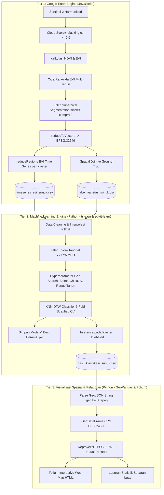

# DEKONSTRUKSI ARSITEKTUR KODE VICO PRATAMA (B1, B2, B3)
**Dokumen Analisis Teknis & Audit Repositori**  
*Lokasi Referensi:* `Analisis Code Vico/rojolele_klaten_salatiga_code`  
*Target Implementasi Baru:* `PROGRAM/.agents/`

---

## 1. Ikhtisar Arsitektur Tiga Tahap (Tri-Tier Architecture)

Pipeline kode Vico Pratama yang diadaptasi untuk varietas Srinuk di Klaten dan Salatiga terbagi menjadi tiga modul utama:



---

## 2. Bedah Mendalam Modul B.1: `B1_pemrosesan_data_spasial_sentinel.js`

Modul ini bertanggung jawab atas seluruh ekstraksi data citra satelit dan segmentasi berbasis objek di Google Earth Engine.

### 2.1. Parameter & Konfigurasi Global (Lines 9–17)
- `startDate = '2017-03-28'`, `endDate = '2026-04-30'`: Rentang waktu 9 tahun untuk menangkap dinamika historis.
- `snic_size = 9`: Ukuran benih superpixel (seed spacing) dalam pixel. Pada skala 10m Sentinel-2, ukuran 9 pixel merepresentasikan resolusi spasial dasar $\approx 90\text{ m} \times 90\text{ m} = 0.81\text{ ha}$.
- `snic_compactness = 10`: Faktor kekompakan bentuk klaster (trade-off antara homogenitas spektral vs regularitas spasial). Nilai 10 cukup mempertahankan batas petak sawah alami.
- `export_folder = 'earthengine_srinuk'`: Direktori target di Google Drive pengguna.

### 2.2. Aset Batas & Ground Truth (Lines 18–46)
- Batas wilayah diambil dari GADM level 3 (`NAME_3: Tulung, Delanggu` di Klaten) dan GADM level 2 (`NAME_2: Salatiga`).
- Ground truth diambil dari 2 koleksi asset pengguna:
  - `users/mhakimgf/Salatiga/ground_truth_salatiga_final_labeled`
  - `users/mhakimgf/ground_truth_klaten_final_labeled`
  - Digabungkan melalui `merge()` menjadi `gt_gabungan`.

### 2.3. Pemrosesan Citra & Cloud Masking Modern (Lines 47–86)
- **Dataset**: `COPERNICUS/S2_HARMONIZED` (Level-2A Surface Reflectance harmonized).
- **Cloud Masking**: Menggunakan model AI Google **Cloud Score+** (`GOOGLE/CLOUD_SCORE_PLUS/V1/S2_HARMONIZED`).
  - Menggunakan fungsi `linkCollection()` untuk menautkan band QA `cs` ke citra Sentinel-2.
  - Threshold: `cs >= 0.6` (menghapus piksel awan tebal, awan tipis/cirrus, dan bayangan awan).
  - Formula NDVI:
    $$\text{NDVI} = \frac{B_8 - B_4}{B_8 + B_4}$$
  - Formula EVI (Enhanced Vegetation Index):
    $$\text{EVI} = 2.5 \times \frac{(B_8 / 10000) - (B_4 / 10000)}{(B_8 / 10000) + 6(B_4 / 10000) - 7.5(B_2 / 10000) + 1}$$
    *Catatan*: Nilai band dibagi 10.000 untuk mengubah Digital Number (DN) ke skala Surface Reflectance [0, 1]. Diberi `.clamp(-1, 1).toFloat()`.

### 2.4. Segmentasi Objek SNIC (Lines 92–123)
- Menghitung rata-rata EVI multi-tahun: `filtered_s2.select('evi').mean()`.
- **Krusial**: `mean()` di GEE menghilangkan informasi CRS dan skala bawaan citra. Vico mengatasinya dengan `setDefaultProjection({ crs: 'EPSG:32749', scale: 10 })` (UTM Zona 49S Jawa Tengah).
- Menjalankan algoritma `ee.Algorithms.Image.Segmentation.SNIC`:
  - Input: `avg_evi`
  - `size: 9`, `compactness: 10`, `connectivity: 8`
- `reduceToVectors()`:
  - Mengonversi raster klaster ID menjadi feature polygon vektor.
  - Mengurangi beban komputasi dari jutaan piksel menjadi ribuan poligon klaster (`cluster_id`).
  - `eightConnected: true`, `maxPixels: 1e10`, `labelProperty: 'cluster_id'`.

### 2.5. Ekstraksi Profil Waktu (Time Series) & Formatting (Lines 124–175)
- Nama citra diubah formatnya menjadi 8 digit tanggal `YYYYMMDD` via `system:index.slice(0, 8)`.
- Menggunakan `reduceRegions()` dengan `ee.Reducer.mean()` pada skala 10m untuk setiap poligon klaster.
- **Teknik Pivot Tingkat Lanjut di GEE**:
  - GEE menghasilkan tabel bertingkat (long-format triplets: `cluster_id`, `imageId`, `mean`).
  - Vico menggunakan fungsi kustom `format()` yang menerapkan `ee.Join.saveAll('matches')` untuk menggabungkan seluruh observasi tanggal menjadi kolom-kolom mendatar (wide-format: baris = `cluster_id`, kolom = tanggal-tanggal observasi).
  - Diekspor ke Google Drive sebagai CSV: `timeseries_evi_srinuk_salatiga_klaten.csv`.

### 2.6. Spatial Join Pelabelan Ground Truth (Lines 177–207)
- Menghubungkan poligon klaster dengan titik/poligon ground truth menggunakan `ee.Filter.intersects` dengan `maxError: 10`.
- Menyimpan nama varietas (`varietas`) dari ground truth ke poligon klaster beririsan via `ee.Join.saveFirst()`.
- Diekspor ke Drive sebagai CSV label: `label_varietas_srinuk_salatiga_klaten.csv`.

---

## 3. Bedah Mendalam Modul B.2: `B2_klasifikasi_srinuk.py`

Modul ini adalah *core engine* pembelajaran mesin untuk klasifikasi deret waktu fenologi padi.

### 3.1. Struktur Objek `SrinukClassification_KNNDTW`
Vico merancang arsitektur berorientasi objek (OOP) yang bersih:
- `__init__()`: Inisialisasi path direktori, nama file, set random state (42), dan pembuatan folder `experiment/` serta `saved_models/`.
- `_df_preprocess(df)`:
  1. Membersihkan kolom duplikat: `df.loc[:, ~df.columns.duplicated(keep='first')]`.
  2. Menyaring hanya kolom tanggal yang valid (8 digit numerik `YYYYMMDD`) dan mengurutkannya secara kronologis.
  3. **Imputasi Gap Data**:
     ```python
     df.loc[:, date_cols] = df.loc[:, date_cols].interpolate(axis=1).bfill(axis=1).ffill(axis=1)
     ```
     Menghilangkan nilai `NaN` akibat cloud masking dengan interpolasi linier horizontal, diikuti backward fill dan forward fill untuk data di ujung awal/akhir.
- `preprocess()`:
  - Membaca data time series dan data label.
  - Memetakan label ground truth menjadi format biner:
    ```python
    self.labeled_df['label'] = self.labeled_df[label_col].apply(
        lambda x: 'srinuk' if isinstance(x, str) and x.strip().lower() == 'srinuk' else 'non-srinuk'
    )
    ```
  - Memisahkan data menjadi dua kelompok: `wilayah_labeled` (untuk training & cross-validation) dan `wilayah_not_labeled` (untuk inferensi/prediksi luas wilayah).

### 3.2. Prosedur Hyperparameter Tuning (`tune()`)
- Mencari kombinasi parameter terbaik secara exhaustive grid-search:
  - **Constraint DTW**: `sakoe_chiba` vs `itakura` vs `default`.
  - **Radius Sakoe-Chiba**: Nilai jendela temporal `[10, 15]`.
  - **K-Neighbors**: `[3, 5]`.
  - **Rentang Tahun (Temporal Windowing)**: `start: [2018, 2020]`, `span: [3, 5]`.
- **Evaluasi Cross-Validation**:
  - Menggunakan `StratifiedKFold(n_splits=5, shuffle=True, random_state=42)`.
  - Metrik evaluasi: `cross_val_score(..., scoring='accuracy', n_jobs=-1)`.
- Mengimplementasikan `get_metric_func()`:
  ```python
  def dtw_distance(x, y):
      x_formatted = to_time_series(x)
      y_formatted = to_time_series(y)
      if constraint == 'sakoe_chiba':
          return dtw(x_formatted, y_formatted, global_constraint="sakoe_chiba", sakoe_chiba_radius=radius)
      return dtw(x_formatted, y_formatted)
  ```
- Menyimpan parameter terbaik ke file teks (`tuning_srinuk.txt`) dan serialisasi model dengan `pickle` (`params_srinuk_{year}.pkl`).

### 3.3. Inferensi Skala Penuh (`predict()`)
- Mengambil subset fitur tahun terbaik pada data tanpa label (`wilayah_not_labeled`).
- Menjalankan `best_model.predict(X_subset)`.
- Menggabungkan data latih (ground truth) dan data hasil prediksi menjadi satu tabel komprehensif: `hasil_klasifikasi_srinuk_salatiga_klaten.csv`.

---

## 4. Bedah Mendalam Modul B.3: `B3_visualisasi_peta_klasifikasi.py`

Modul ini bertanggung jawab menghasilkan dashboard peta interaktif untuk diseminasi hasil spasial.

### 4.1. Rekonstruksi Geometri Spasial (Lines 48–79)
- Ekspor GEE menyimpan geometri poligon dalam format GeoJSON string pada kolom `.geo`.
- `load_and_prepare_data()` mem-parse string tersebut menggunakan `shapely.geometry.shape(json.loads(x))`.
- Membangun `geopandas.GeoDataFrame` dengan koordinat geodetik `EPSG:4326` (WGS84).
- **Perhitungan Luas Akurat**:
  - Mengubah CRS ke UTM Zona 49S (`EPSG:32749`): `gdf_utm = gdf.to_crs(UTM_CRS)`.
  - Menghitung luas eksak dalam meter persegi: `gdf['area_m2'] = gdf_utm.geometry.area`.
  - Konversi ke hektare: `gdf['area_ha'] = gdf['area_m2'] / 10000`.

### 4.2. Peta Interaktif Multi-Layer Folium (Lines 102–251)
- Basemap dinamis: Citra Satelit Esri World Imagery, OpenStreetMap, dan CartoDB Light.
- Pemisahan `FeatureGroup`:
  - `🌾 Srinuk` (Warna `#2ecc71` - Emerald Green, Opacity 0.6)
  - `🚫 Non-Srinuk` (Warna `#e74c3c` - Crimson Red, Opacity 0.2)
- Elemen UI Interaktif:
  - Tooltip instan saat kursor melintas (`hover`).
  - Popup kaya informasi saat diklik: menampilkan Cluster ID, luas dalam Ha, dan luas dalam m².
  - Minimap, tombol layar penuh (Fullscreen), dan floating legend HTML kustom yang merangkum jumlah klaster dan total luas masing-masing varietas.
  - Otomatis membuka peramban web saat eksekusi selesai (`webbrowser.open`).

---

## 5. Analisis Kelemahan Teknis & Titik Kritis (Bottlenecks & Flaws)

Berdasarkan audit mendalam, terdapat beberapa aspek krusial dari kode Vico yang perlu ditingkatkan dalam penelitian lanjutan ini:

| Komponen | Implementasi Kode Vico | Kelemahan / Keterbatasan | Solusi Perbaikan di Sandboxing Baru |
| :--- | :--- | :--- | :--- |
| **Pivot Tabel di GEE** | Menggunakan `ee.Join.saveAll()` pada koleksi citra besar. | Sering mengalami error **"User memory limit exceeded"** atau timeout jika rentang tahun panjang (>5 tahun) atau ROI luas. | Ekspor long-format CSV sederhana (Cluster ID, Date, Index Value) lalu pivot lokal menggunakan `pandas.DataFrame.pivot()`. |
| **Skala Waktu Observasi** | Hanya mengandalkan interpolasi linier antar tanggal akuisisi acak Sentinel-2 (5-10 hari). | Gap antar observasi tidak beraturan (irregular intervals) mendistorsi DTW jika ada tutupan awan berkepanjangan pada musim hujan. | Menerapkan resampling temporal teratur (misal: 10-daily atau 15-daily median compositing) sebelum interpolasi. |
| **Pilihan Indeks Vegetasi** | Hanya mengekstraksi dan mengklasifikasikan **EVI**. | EVI sangat baik untuk kerapatan kanopi tinggi, tetapi kurang sensitif terhadap fase genangan air awal (inundasi) dan kadar air daun. | Tambahkan **NDVI** (pertumbuhan vegetatif) dan **NDWI / LSWI** (deteksi banjir pembajakan sawah dan panen). |
| **Skema Klasifikasi** | Biner murni: `srinuk` vs `non-srinuk`. | Mengabaikan kenyataan bahwa non-srinuk terdiri dari varietas spesifik berumur pendek seperti **Inpari 32** dan tebu/palawija. | Bangun skema multiclass atau biner eksplisit: **Rojolele Srinuk vs Inpari 32 vs Non-Sawah**. |
| **Kompleksitas Komputasi KNN-DTW** | Menguji seluruh klaster tak berlabel dengan KNN-DTW berjarak DTW penuh $O(N^2 \cdot T^2)$. | Sangat lambat jika data klaster mencapai ribuan. Waktu prediksi bisa berjam-jam di CPU standar. | Gunakan fast DTW approximations (`c-dtw`), atau gunakan KNN-DTW sebagai benchmark validasi bersama **Random Forest / XGBoost** dengan fitur statistik fenologis (Peak EVI, AUC, Greenup Slope). |
| **Penanganan Koordinat** | Reproyeksi UTM manual hanya pada satu zona (32749). | Jika ROI berpindah ke wilayah lain (misal: Jawa Barat UTM 48S), kode akan mengalami distorsi luas. | Buat fungsi dinamis pendeteksi zona UTM otomatis berbasis koordinat bujur. |

---

## 6. Kesimpulan & Rekomendasi Arsitektural untuk Sandboxing

Arsitektur Vico Pratama telah membuktikan bahwa kombinasi **SNIC Superpixel + Indeks Vegetasi + KNN-DTW** memiliki akurasi sangat tinggi (mencapai 98% di skripsi aslinya). Namun, kode tersebut dirancang untuk satu varietas endemik (Pandanwangi di Cianjur, lalu diuji coba untuk Srinuk di Klaten/Salatiga).

Untuk tugas akhir baru di **Delanggu, Klaten** (dengan perbandingan **Srinuk vs Inpari 32**):
1. **Pipeline GEE** harus dimodifikasi untuk mengekspor multi-indeks (`NDVI`, `EVI`, `NDWI`) berbasis titik/poligon `delanggu_geojson_tuned.geojson`.
2. **Preprocessing Python** harus memperhitungkan kalender tanam spesifik: Srinuk ditanam pada musim kemarau (Mei–September), sedangkan Inpari 32 memiliki siklus lebih cepat (110–115 hari) dan bisa ditanam beberapa kali setahun.
3. **Penyimpanan Kode Sandboxing**: Seluruh script hasil refactoring dan eksperimen akan disimpan secara rapi di modul `PROGRAM/` dengan panduan skill yang ditanam di `.agents/skills/`.
