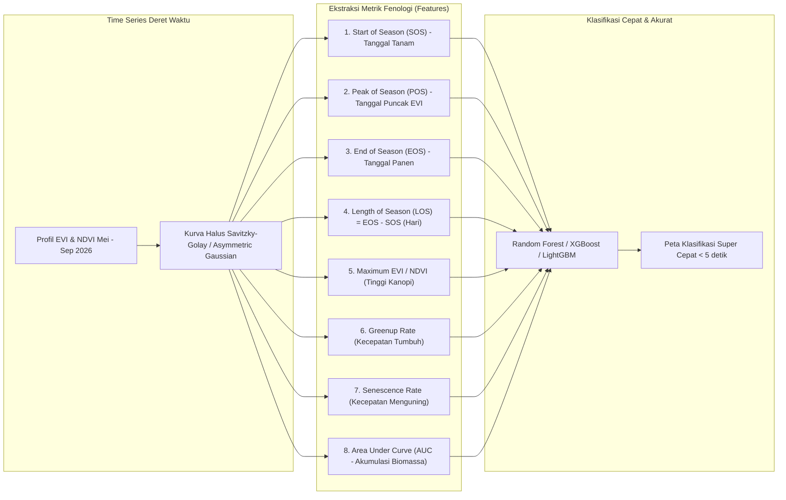

# PERBANDINGAN METODOLOGI: SKRIPSI VICO (2025) VS TUGAS AKHIR BARU (2026)
**Diferensiasi Ilmiah, Kebaruan (Novelty), dan Strategi Klasifikasi Multivarietas**  
*Studi Kasus:* Padi Rojolele Srinuk vs Inpari 32 di Delanggu, Kabupaten Klaten  
*Program Studi:* Informatika, Fakultas Teknologi Informasi dan Sains (FTIS) Universitas Katolik Parahyangan

---

## 1. Matriks Perbandingan Komparatif

Tabel berikut merangkum perbedaan esensial antara penelitian skripsi Vico Pratama (2025) dengan tugas akhir baru yang sedang dikembangkan:

| Dimensi Parameter | Skripsi Vico Pratama (2025) | Tugas Akhir Baru (2026) | Implikasi & Signifikansi Ilmiah |
| :--- | :--- | :--- | :--- |
| **Varietas Target** | Padi Pandanwangi Cianjur (Indikasi Geografis). | **Padi Rojolele Srinuk** (SK Kementan 2019) vs **Inpari 32 Pasar Sukamandi**. | Memperluas pemetaan dari varietas lokal Jawa Barat ke varietas lokal mutasi radiasi unggulan Klaten, berhadapan langsung dengan varietas nasional paling dominan (Inpari 32). |
| **Lokasi Penelitian** | Kabupaten Cianjur, Jawa Barat (kemudian diuji coba awal di Klaten & Salatiga). | **Kecamatan Delanggu, Kabupaten Klaten, Jawa Tengah** (kawasan lumbung pangan dan cikal bakal Rojolele). | Karakteristik topografi Klaten lebih homogen/datar dibandingkan Cianjur yang berbukit, mengurangi distorsi bayangan lereng (*topographic shadow*). |
| **Skema Klasifikasi** | Biner: `Pandanwangi` vs `Non-Pandanwangi`. | **Biner & Multiclass Terarah**: `Rojolele Srinuk` vs `Inpari 32` vs `Non-Padi`. | Mengatasi bias kelas `non-*` yang terlalu heterogen pada penelitian Vico; klasifikasi kini membedakan dua varietas padi sejati (*intra-crop varietal discrimination*). |
| **Karakteristik Agronomi** | Umur tanam Pandanwangi panjang (~145–155 hari). Ditanam sepanjang tahun pada lahan beririgasi teknis. | **Srinuk**: ~120–130 hari, batang kokoh, ditanam khusus **musim kemarau (MK)**.<br>**Inpari 32**: ~110–115 hari, tahan wereng coklat, ditanam fleksibel (MH maupun MK). | Variasi umur tanam (~15–20 hari selisih) dan preferensi kalender musim menciptakan disparitas profil kurva fenologi yang dapat dideteksi sensor optik. |
| **Data Ground Truth** | Titik survei lapangan di Cianjur dan aset lawas di Klaten/Salatiga. | **Survei Lapangan Segar (3 September 2026)** yang divalidasi langsung ke petani Delanggu + Deliniasi Ulang Poligon Presisi (`delanggu_geojson_tuned.geojson`). | Ground truth memiliki akurasi posisi tinggi, tidak ada pergeseran spasial (*spatial offset*), dan terverifikasi secara fenologis saat pengamatan di lapangan. |
| **Sensor & Fitur Spektral** | Sentinel-2 + Landsat 5/7/8 gap-filling.<br>Hanya menggunakan **EVI**. | **Sentinel-2 Harmonized (10m) + Cloud Score+**.<br>Multi-indeks: **NDVI** (kanopi), **EVI** (kerapatan biomassa), dan **NDWI/LSWI** (inundasi air/genangan). | Menangkap fase lengkap siklus padi: pembajakan & genangan (air), pertumbuhan vegetatif & anakan (NDVI), puncak kanopi bunting (EVI), hingga pengeringan & pematangan (senescence). |
| **Model Pembelajaran Mesin** | KNN-DTW (Dynamic Time Warping) dengan Sakoe-Chiba constraint ($r=10, 15$, $K=3, 5$). | **Dual-Engine Benchmark**:<br>1. **KNN-DTW** (sebagai baseline kompatibel Vico).<br>2. **Feature-Engineered ML** (Random Forest & XGBoost berbasis statistik kurva fenologi). | Menyelesaikan masalah efisiensi komputasi Vico; model berbasis fitur fenologi mampu mengklasifikasikan ribuan klaster dalam hitungan detik. |
| **Resolusi Segmentasi** | SNIC pada citra komposit EVI rata-rata multi-tahun ($size=9, comp=10$). | SNIC adaptif per musim tanam (musim kemarau 2026) dipadukan dengan batas petak sawah lokal Delanggu. | Menghindari *under-segmentation* akibat variasi tutupan lahan historis yang bergeser antar tahun. |

---

## 2. Analisis Fenologi: Mengapa Srinuk dan Inpari 32 Dapat Dipisahkan?

Tantangan terbesar dalam penginderaan jauh pertanian adalah membedakan varietas yang berada dalam satu spesies (*Oryza sativa*). Namun, analisis agronomi dan data lapangan 3 September 2026 membuktikan adanya perbedaan kurva yang sangat kuat:

```
Nilai Indeks
  1.0 |                              [PUNCAK VEGETATIF SRINUK]
      |                                      /\ (NDVI ~0.70 - 0.75)
  0.8 |                                     /  \
      |               [PUNCAK INPARI 32]   /    \
  0.6 |                      /\           /      \
      |                     /  \         /        \
  0.4 |                    /    \_______/          \   [SENESCENCE / PANEN INPARI 32]
      |     [GENANGAN]    /     (Fase Bunting)      \  (NDVI drop to ~0.35 - 0.40)
  0.2 |_______/\_________/                           \___
  0.0 |_________________________________________________________
      Mei           Juni          Juli          Agustus       September (Survei 3 Sep)
```

### 2.1. Karakteristik Rojolele Srinuk di Delanggu
- **Genetik & Pemuliaan**: Merupakan hasil radiasi sinar gamma BATAN bekerja sama dengan Pemkab Klaten terhadap varietas legendaris Rojolele (yang tadinya berumur 160 hari dan berbatang tinggi mudah roboh). Srinuk memiliki postur ~105–110 cm dengan umur 120–130 hari.
- **Kondisi Lapangan 3 September 2026**:
  - Petani menuturkan bahwa Srinuk diprioritaskan ditanam pada **musim kemarau (puncak panas)** karena membutuhkan intensitas radiasi matahari optimal untuk memaksimalkan aroma pandan dan tekstur pulennya, serta meminimalkan serangan hama jamur/bakteri daun berlebih.
  - Pada 3 September 2026, Srinuk masih berada pada fase **pengisian bulir akhir (grain filling)** menuju pematangan lambat. Kanopinya masih lebat dan hijau:
    - **NDVI $\approx 0.65 - 0.72$**
    - **EVI $\approx 0.50 - 0.58$**

### 2.2. Karakteristik Inpari 32 (Pasar Sukamandi) di Delanggu
- **Genetik & Agronomi**: Varietas inbrida padi sawah irigasi keluaran Balitpa dengan umur genjah (~110–115 hari) dan bobot gabah tinggi.
- **Kondisi Lapangan 3 September 2026**:
  - Ditanam lebih awal atau memiliki siklus kematangan yang jauh lebih cepat dibandingkan Srinuk.
  - Pada 3 September 2026, petak Inpari 32 sudah memasuki fase **senescence matang penuh / pengeringan batang / sebagian sudah dipanen**:
    - **NDVI turun drastis ke $\approx 0.35 - 0.42$**
    - **EVI turun ke $\approx 0.22 - 0.28$**
- **Disparitas Spektral**: Kontras spektral sebesar $\Delta \text{NDVI} \approx 0.30$ dan $\Delta \text{EVI} \approx 0.27$ pada awal September merupakan tanda tangan spektral (*spectral fingerprint*) yang sangat nyata untuk membedakan kedua varietas.

---

## 3. Peningkatan Metodologi: Dari Single-Index ke Multi-Index Fenologi

Vico Pratama hanya mengandalkan satu indeks, yaitu EVI. Dalam penelitian baru ini, kita memperkaya representasi spektral menjadi **Tiga Pilar Indeks**:

1. **Normalized Difference Vegetation Index (NDVI)**:
   $$\text{NDVI} = \frac{\text{NIR} - \text{Red}}{\text{NIR} + \text{Red}} = \frac{B_8 - B_4}{B_8 + B_4}$$
   *Fungsi*: Mendeteksi biomassa kanopi hijau awal, perkembangan daun muda, dan fase senescence.
2. **Enhanced Vegetation Index (EVI)**:
   $$\text{EVI} = 2.5 \times \frac{\text{NIR} - \text{Red}}{\text{NIR} + 6 \cdot \text{Red} - 7.5 \cdot \text{Blue} + 1}$$
   *Fungsi*: Mencegah saturasi saat kanopi padi sangat rapat (puncak anakan maksimum dan bunting) serta mengurangi gangguan reflektansi latar belakang tanah basah.
3. **Land Surface Water Index / Normalized Difference Water Index (LSWI / NDWI)**:
   $$\text{LSWI} = \frac{\text{NIR} - \text{SWIR1}}{\text{NIR} + \text{SWIR1}} = \frac{B_8 - B_{11}}{B_8 + B_{11}}$$
   *Fungsi*: Kunci utama mendeteksi **fase genangan air saat pengolahan tanah (transplanting/flooding)**. Kriteria $\text{LSWI} > \text{NDVI}$ atau $\text{LSWI} > \text{EVI}$ adalah metode baku remote sensing internasional untuk mendeteksi tanggal mulai tanam (*planting date*).

---

## 4. Rekayasa Fitur Fenologi (Phenological Feature Engineering)

Sebagai komplementer terhadap KNN-DTW (yang beroperasi langsung pada deret waktu mentah berbobot komputasi tinggi), kita menambahkan ekstraksi parameter fenologis berbasis kurva:



### Keunggulan Ekstraksi Metrik Fenologi:
1. **Interpretasi Agronomi Terbuka**: Dosen penguji dapat melihat dengan jelas perbedaan rata-rata *Length of Season (LOS)* antara Srinuk (125 hari) dan Inpari 32 (112 hari).
2. **Skalabilitas Spasial**: Sangat ringan dikomputasi untuk pemetaan satu kabupaten penuh (ribuan hektare) tanpa terkendala komputasi kuadratik DTW.

---

## 5. Nilai Kebaruan & Kontribusi untuk Naskah Tugas Akhir FTIS UNPAR

Saat menulis Bab 1 (Pendahuluan) dan Bab 4 (Hasil & Pembahasan), penelitian ini memiliki posisi ilmiah yang kuat:

1. **Menjawab Limitasi Skripsi Vico (2025)**:
   - Vico menyatakan dalam sarannya bahwa penelitiannya terbatas pada skema biner dan memerlukan pengujian pada varietas lokal lainnya dengan kondisi mikroklimat berbeda. Tugas akhir ini merealisasikan saran tersebut secara langsung.
2. **Koleksi Ground Truth Autentik**:
   - Memiliki data primer hasil survei lapangan langsung di sentra padi Delanggu (September 2026) dengan deliniasi poligon petak sawah yang telah dikalibrasi presisi.
3. **Penggunaan Masking Mutakhir (Cloud Score+)**:
   - Berbeda dari metode lama berbasis band QA60 yang sering meloloskan kabut tipis (*haze*), integrasi Cloud Score+ (`cs >= 0.6`) memberikan nilai spektral permukaan yang jauh lebih bersih.
4. **Analisis Komparasi Algoritma**:
   - Tidak hanya mereplikasi KNN-DTW, namun membandingkan performanya (akurasi, F1-Score, waktu komputasi, dan kebutuhan memori) terhadap model berbasis fitur fenologi tabular.
