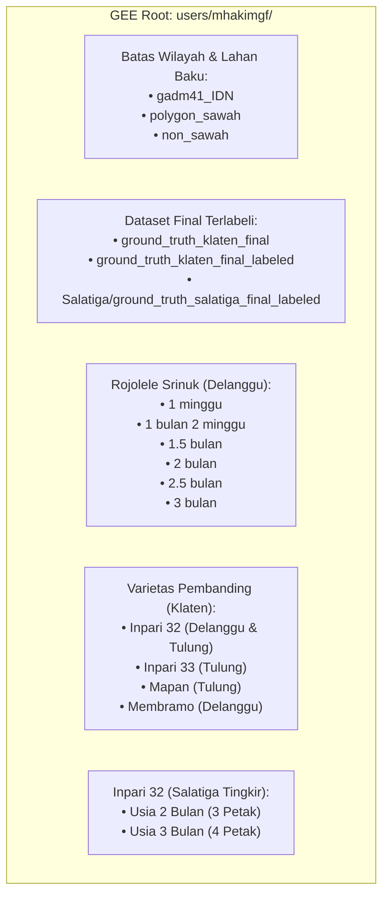

# KATALOG ASSET GOOGLE EARTH ENGINE (GEE) - AKUN: users/mhakimgf
## Data Ground Truth Lapangan, Batas Administrasi, dan Sampel Varietas Padi
### Wilayah Kajian: Kabupaten Klaten (Delanggu & Tulung) & Kota Salatiga (Tingkir)

Dokumen ini mencatat seluruh asset resmi di Google Earth Engine (GEE) milik akun `users/mhakimgf` yang digunakan dalam penelitian Tugas Akhir Deteksi Padi Rojolele Srinuk.

---

## 1. Klasifikasi Asset Berdasarkan Fungsi & Wilayah



---

## 2. Rincian Lengkap Asset GEE

### A. Batas Administrasi & Referensi Lahan Baku
| No | Asset ID GEE | Tipe Objek | Keterangan / Cakupan |
| :---: | :--- | :---: | :--- |
| 1 | `users/mhakimgf/gadm41_IDN` | FeatureCollection | Batas Administrasi Resmi Indonesia Level 0-4 (GADM 4.1) |
| 2 | `users/mhakimgf/polygon_sawah` | FeatureCollection | Poligon acuan lahan baku sawah (Peta LBS / Persawahan) |
| 3 | `users/mhakimgf/non_sawah` | FeatureCollection | Poligon tutupan non-sawah (pemukiman, industri, jalan) di Delanggu |

### B. Dataset Final Ground Truth Gabungan & Terlabeli
| No | Asset ID GEE | Tipe Objek | Keterangan / Varietas |
| :---: | :--- | :---: | :--- |
| 4 | `users/mhakimgf/ground_truth_klaten_final` | FeatureCollection | Seluruh titik/poligon survei lapangan Klaten (Delanggu & Tulung) |
| 5 | `users/mhakimgf/ground_truth_klaten_final_labeled` | FeatureCollection | Dataset Klaten terverifikasi lengkap dengan label varietas & usia |
| 6 | `users/mhakimgf/Salatiga/ground_truth_salatiga_final_labeled` | FeatureCollection | Dataset Salatiga terverifikasi lengkap dengan label Inpari 32 |

### C. Ground Truth Padi Rojolele Srinuk (Kecamatan Delanggu, Klaten)
| No | Asset ID GEE | Varietas | Fase Usia Saat Survei | Tanggal Survei |
| :---: | :--- | :---: | :---: | :---: |
| 7 | `users/mhakimgf/rojolele_srinuk_delanggu_1_minggu_200326` | Rojolele Srinuk | 1 Minggu (Fase Awal Tanam / Genangan) | 20-Mar-2026 |
| 8 | `users/mhakimgf/rojolele_srinuk_delanggu_1_bulan_2_minggu_220326` | Rojolele Srinuk | 1 Bulan 2 Minggu (Vegetatif Aktif) | 22-Mar-2026 |
| 9 | `users/mhakimgf/rojolele_srinuk_delanggu_1_5_bulan_200326` | Rojolele Srinuk | 1.5 Bulan (Vegetatif Anakan Maksimum) | 20-Mar-2026 |
| 10 | `users/mhakimgf/rojolele_srinuk_delanggu_2_bulan_200326` | Rojolele Srinuk | 2 Bulan (Inisiasi Malai / Primordia) | 20-Mar-2026 |
| 11 | `users/mhakimgf/rojolele_srinuk_delanggu_2_5_bulan_200326` | Rojolele Srinuk | 2.5 Bulan (Fase Bunting / Heading) | 20-Mar-2026 |
| 12 | `users/mhakimgf/rojolele_srinuk_delanggu_3_bulan_200326` | Rojolele Srinuk | 3 Bulan (Fase Pengisian Butir / Pematangan) | 20-Mar-2026 |

### D. Ground Truth Varietas Pembanding di Klaten (Delanggu & Tulung)
| No | Asset ID GEE | Varietas | Lokasi Kecamatan | Fase Usia |
| :---: | :--- | :---: | :---: | :---: |
| 13 | `users/mhakimgf/inpari32_delanggu_3_bulan_200326` | Inpari 32 | Delanggu | 3 Bulan |
| 14 | `users/mhakimgf/inpari32_delanggu_3_5_bulan_200326` | Inpari 32 | Delanggu | 3.5 Bulan (Siap Panen) |
| 15 | `users/mhakimgf/inpari32_tulung_1_bulan_200326` | Inpari 32 | Tulung | 1 Bulan |
| 16 | `users/mhakimgf/inpari32_tulung_3_bulan_200326` | Inpari 32 | Tulung | 3 Bulan |
| 17 | `users/mhakimgf/inpari33_tulung_1_bulan_200326` | Inpari 33 | Tulung | 1 Bulan |
| 18 | `users/mhakimgf/mapan_tulung_3_bulan_200326` | Mapan | Tulung | 3 Bulan |
| 19 | `users/mhakimgf/membramo_delanggu_3_bulan_200326` | Membramo | Delanggu | 3 Bulan |

### E. Ground Truth Inpari 32 di Kecamatan Tingkir, Kota Salatiga
| No | Asset ID GEE | Varietas | Lokasi | Fase Usia | ID Petak |
| :---: | :--- | :---: | :---: | :---: | :---: |
| 20 | `users/mhakimgf/Salatiga/inpari32_tingkir_2_bulan_260326` | Inpari 32 | Tingkir, Salatiga | 2 Bulan | Petak A |
| 21 | `users/mhakimgf/Salatiga/inpari32_tingkir_2_bulan_260326_2` | Inpari 32 | Tingkir, Salatiga | 2 Bulan | Petak B |
| 22 | `users/mhakimgf/Salatiga/inpari32_tingkir_2_bulan_260326_3` | Inpari 32 | Tingkir, Salatiga | 2 Bulan | Petak C |
| 23 | `users/mhakimgf/Salatiga/inpari32_tingkir_3_bulan_260326` | Inpari 32 | Tingkir, Salatiga | 3 Bulan | Petak 1 |
| 24 | `users/mhakimgf/Salatiga/inpari32_tingkir_3_bulan_260326_2` | Inpari 32 | Tingkir, Salatiga | 3 Bulan | Petak 2 |
| 25 | `users/mhakimgf/Salatiga/inpari32_tingkir_3_bulan_260326_3` | Inpari 32 | Tingkir, Salatiga | 3 Bulan | Petak 3 |
| 26 | `users/mhakimgf/Salatiga/inpari32_tingkir_3_bulan_260326_4` | Inpari 32 | Tingkir, Salatiga | 3 Bulan | Petak 4 |

---

## 3. Cuplikan Kode Integrasi (Code Snippets)

### A. JavaScript (Google Earth Engine Code Editor)
```javascript
// 1. Memuat Batas Wilayah & Non-Sawah
var gadm = ee.FeatureCollection('users/mhakimgf/gadm41_IDN');
var non_sawah = ee.FeatureCollection('users/mhakimgf/non_sawah');
var polygon_sawah = ee.FeatureCollection('users/mhakimgf/polygon_sawah');

// 2. Memuat Ground Truth Final Terlabeli
var gt_klaten = ee.FeatureCollection('users/mhakimgf/ground_truth_klaten_final_labeled');
var gt_salatiga = ee.FeatureCollection('users/mhakimgf/Salatiga/ground_truth_salatiga_final_labeled');
var gt_gabungan = gt_klaten.merge(gt_salatiga);

// 3. Memuat Poligon Spesifik Rojolele Srinuk Berbagai Usia
var srinuk_1mgg = ee.FeatureCollection('users/mhakimgf/rojolele_srinuk_delanggu_1_minggu_200326');
var srinuk_1_5bln = ee.FeatureCollection('users/mhakimgf/rojolele_srinuk_delanggu_1_5_bulan_200326');
var srinuk_2bln = ee.FeatureCollection('users/mhakimgf/rojolele_srinuk_delanggu_2_bulan_200326');
var srinuk_2_5bln = ee.FeatureCollection('users/mhakimgf/rojolele_srinuk_delanggu_2_5_bulan_200326');
var srinuk_3bln = ee.FeatureCollection('users/mhakimgf/rojolele_srinuk_delanggu_3_bulan_200326');

var all_srinuk = srinuk_1mgg.merge(srinuk_1_5bln).merge(srinuk_2bln).merge(srinuk_2_5bln).merge(srinuk_3bln);

Map.addLayer(all_srinuk, {color: 'green'}, 'Ground Truth Srinuk All Ages');
Map.addLayer(non_sawah, {color: 'red'}, 'Ground Truth Non-Sawah');
```

### B. Python (Earth Engine API)
```python
import ee
ee.Initialize(project='ardent-particle-480118-k7')

# Memuat Ground Truth Langsung dari Asset Pengguna
gt_klaten = ee.FeatureCollection('users/mhakimgf/ground_truth_klaten_final_labeled')
gt_salatiga = ee.FeatureCollection('users/mhakimgf/Salatiga/ground_truth_salatiga_final_labeled')
gt_all = gt_klaten.merge(gt_salatiga)
non_sawah = ee.FeatureCollection('users/mhakimgf/non_sawah')

print(f"Total Fitur GT Tergabung: {gt_all.size().getInfo()}")
```

---
*Catatan: Dokumen ini terdaftar sebagai referensi utama GEE Asset Registry untuk penelitian Tugas Akhir.*
