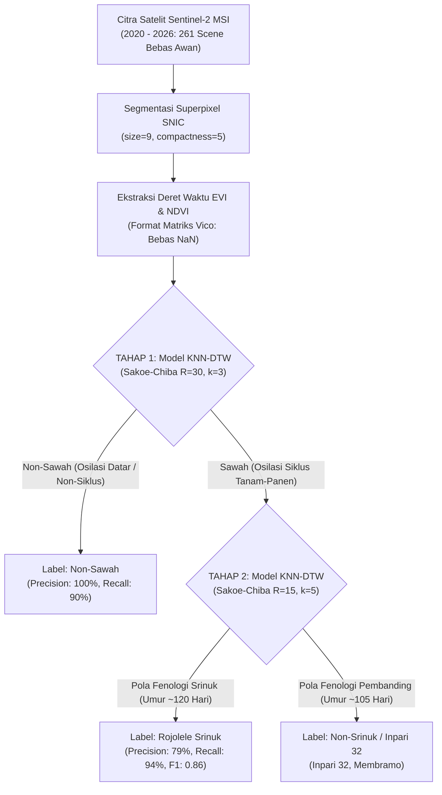

# CATATAN MENDALAM: METODE & HASIL EVALUASI MODEL
## Klasifikasi Fenologi Padi Berjenjang Menggunakan SNIC, KNN, dan Sakoe-Chiba DTW
### Studi Kasus: Deteksi Padi Rojolele Srinuk di Kecamatan Delanggu, Kabupaten Klaten
**Peneliti**: M. Hakim GF | **Referensi Metodologi**: Skripsi Vico Pratama (2025)

---

## 1. Arsitektur Metodologi Berjenjang Dua Tahap

Penelitian ini mengadopsi pendekatan klasifikasi bertingkat (*two-stage hierarchical classification*) untuk mengatasi kompleksitas lanskap pertanian tropis di Pulau Jawa:



### Mengapa Harus Dua Tahap?
1. **Pemisahan Domain Sawah vs Non-Sawah (Tahap 1)**: Membedakan objek lahan sawah dari tutupan tanah non-sawah (pemukiman padat, kawasan industri, jalan raya) sangat efektif dilakukan dengan mendeteksi **osilasi musiman** (fase bera/genangan ber-EVI rendah $\rightarrow$ fase vegetatif ber-EVI tinggi $\rightarrow$ pematangan/panen ber-EVI menurun).
2. **Diskriminasi Varietas Spesifik (Tahap 2)**: Membedakan sesama padi (Rojolele Srinuk vs Inpari 32/Membramo) tidak dapat menggunakan nilai spektral instan tunggal karena pantulan vegetasi hijau padi sangat identik pada fase puncak. Pembeda utamanya terletak pada **panjang siklus pertumbuhan (fenologi)**:
   - **Rojolele Srinuk**: Varietas lokal hasil radiasi mutasi BATAN–Pemkab Klaten berumur sedang-dalam (**115–120 hari**), dengan laju pertumbuhan anakan yang lebih lambat dan fase pengisian malai yang lebih panjang.
   - **Inpari 32 / Varietas Pembanding**: Varietas unggul baru (VUB) berumur genjah (**105–110 hari**) dengan akselerasi vegetatif cepat dan penurunan tajam jelang panen.

---

## 2. Cara Kerja Metode 1: Simple Non-Iterative Clustering (SNIC)

### 2.1 Konsep Dasar & Keunggulan
SNIC (*Achanta & Süsstrunk, 2017*) adalah algoritma segmentasi superpixel berbasis graf non-iteratif yang mengelompokkan piksel-piksel citra yang bertetangga secara spasial dan homogen secara spektral menjadi satu klaster (poligon superpixel).
* **Kelemahan SLIC Tradisional**: Memerlukan $k$-Means iteratif ($5 - 10$ kali perulangan) di mana batas klaster dapat terpecah (*disconnected components*) dan komputasinya berat di Google Earth Engine.
* **Keunggulan SNIC**: Bersifat **non-iteratif**. Memanfaatkan struktur data antrean berprioritas (*Priority Queue* / Min-Heap) untuk menumbuhkan klaster dari benih (*seed points*) secara serentak, menjamin konektivitas spasial 100%, serta membutuhkan memori komputasi yang jauh lebih rendah.

### 2.2 Formulasi Jarak Jarak Spektral-Spasial
Jarak gabungan $d_{k,p}$ antara piksel kandidat $p = (x_p, y_p)$ dengan pusat klaster $k = (x_k, y_k)$ didefinisikan sebagai:

$$d_{k,p} = \sqrt{\frac{d_{spektral}^2}{s_c^2} + \frac{d_{spasial}^2}{s_s^2} \cdot \left(\frac{m}{s}\right)^2}$$

Di mana:
- $d_{spektral} = \|\mathbf{c}_p - \mathbf{c}_k\|_2$ (jarak Euclidean dalam ruang spektral: Band Red, Green, Blue, NDVI, dan EVI).
- $d_{spasial} = \sqrt{(x_p - x_k)^2 + (y_p - y_k)^2}$ (jarak spasial koordinat piksel).
- $s$ (*size*): Jarak rata-rata antar benih klaster awal, merepresentasikan ukuran superpixel yang diharapkan.
- $m$ (*compactness*): Parameter kekompakan bentuk. Jika $m$ besar, klaster cenderung bulat/segiempat teratur. Jika $m$ kecil, klaster lentur mengikuti batas pematang sawah alami (*boundary adherence*).

### 2.3 Mekanisme Algoritma SNIC
1. **Inisialisasi Kisi Benih**: Tempatkan benih sentroid pada kisi reguler berjarak $s$ piksel.
2. **Priority Queue**: Masukkan seluruh 4-tetangga atau 8-tetangga dari setiap benih ke dalam priority queue, diurutkan berdasarkan jarak terkecil $d_{k,p}$.
3. **Penyebaran & Pembaruan Seketika (*Online Update*)**:
   - Ambil elemen teratas antrean (jarak minimum).
   - Jika piksel belum memiliki label, tetapkan label klaster $k$.
   - **Perbarui sentroid klaster secara online**: Sentroid baru adalah rata-rata kumulatif berjalan dari seluruh piksel yang telah bergabung.
   - Masukkan tetangga baru dari piksel tersebut ke dalam priority queue.
4. **Terminasi**: Proses berhenti saat seluruh piksel dalam ROI telah terlabeli (selesai dalam satu kali lintasan, kompleksitas linear $O(N)$).

### 2.4 Optimasi Multi-Objektif Pareto (Metode Vico Pratama)
Untuk menemukan kombinasi $(size, compactness)$ paling ideal di Delanggu, dilakukan grid search 42 kombinasi parameter ($size \in [4..10], compactness \in [1..100]$) yang dievaluasi dengan fungsi biaya:

$$f(\varpi) = \varpi \cdot \overline{\sigma}^2_{norm} + (1 - \varpi) \cdot \frac{N_{cluster}}{N_{max}}$$

- $\varpi = 0.3$: Memberikan bobot 30% pada homogenitas spektral klaster (variansi EVI rendah) dan 70% pada efisiensi/perampingan jumlah klaster (mencegah over-segmentation).
- $\overline{\sigma}^2_{norm}$: Rata-rata variansi intra-klaster yang dinormalisasi $0 - 1$.
- $\frac{N_{cluster}}{N_{max}}$: Rasio jumlah klaster terhadap jumlah maksimum pengujian.

### 2.5 Hasil Eksperimen SNIC di Kecamatan Delanggu
* **Citra Input Terpilih**: Sentinel-2 MSI tanggal **21 Agustus 2020** (tutupan awan hanya 0.11%, kondisi vegetasi kering-stabil).
* **Parameter Terbaik**:
  - **Size**: **9**
  - **Compactness**: **5**
  - **Skor Multi-Objektif**: **0.281894** (Terendah / Terbaik)
  - **Jumlah Klaster**: **2.921 klaster**
  - **Rata-rata Variansi EVI Intra-Klaster**: **0.005813** (Sangat homogen)
* **Temuan Ilmiah**: Nilai $size = 9$ dan $compactness = 5$ terbukti sangat adaptif terhadap geometri petak sawah di Jawa Tengah. Nilai compactness yang moderat (5) memungkinkan batas superpixel meliuk mengikuti alur pematang dan saluran irigasi tanpa memecah satu petak sawah menjadi terlalu banyak klaster kecil.

---

## 3. Cara Kerja Metode 2: Dynamic Time Warping (DTW) Berkendala Sakoe-Chiba

### 3.1 Masalah Utama: Fenomena *Waktu Tanam Tidak Serentak*
Dalam deret waktu pertanian, membandingkan dua kurva EVI menggunakan jarak Euclidean:

$$d_{Euclid}(X, Y) = \sqrt{\sum_{t=1}^{T} (x_t - y_t)^2}$$

akan **gagal total** apabila petani di dua petak yang berbeda menanam varietas yang persis sama (Rojolele Srinuk), namun waktu tanamnya berselisih 2–3 minggu. Jarak Euclidean membandingkan titik pada indeks waktu yang kaku ($t_i$ dengan $t_i$), sehingga fase anakan petak A akan dipaksa bertanding dengan fase puncak petak B, menghasilkan nilai jarak yang sangat besar seolah-olah keduanya adalah varietas yang berbeda.

### 3.2 Formulasi Matematis Dynamic Time Warping (DTW)
DTW menyelaraskan dua deret waktu $X = (x_1, x_2, \dots, x_N)$ dan $Y = (y_1, y_2, \dots, y_M)$ secara elastis non-linear pada sumbu waktu:

1. **Matriks Jarak Lokal**: $c(i, j) = (x_i - y_j)^2$
2. **Warping Path $W$**: Urutan pasangan indeks $W = (w_1, w_2, \dots, w_K)$ di mana $w_k = (i_k, j_k)$.
   - *Boundary Condition*: $w_1 = (1, 1)$ dan $w_K = (N, M)$.
   - *Monotonicity Condition*: $i_1 \le i_2 \le \dots \le i_K$ dan $j_1 \le j_2 \le \dots \le j_K$.
   - *Continuity Condition*: $i_{k+1} - i_k \le 1$ dan $j_{k+1} - j_k \le 1$.
3. **Akumulasi Biaya Melalui Pemrograman Dinamis (DP)**:

$$D(i, j) = c(i, j) + \min \begin{cases} D(i-1, j) & \text{(Penyisipan / Warping pada X)} \\ D(i, j-1) & \text{(Penghapusan / Warping pada Y)} \\ D(i-1, j-1) & \text{(Kesesuaian Waktu Langsung)} \end{cases}$$

Jarak DTW final adalah nilai pada elemen pojok kanan bawah: $DTW(X, Y) = D(N, M)$.

### 3.3 Kendala Global Sakoe-Chiba (*Sakoe-Chiba Band*)
DTW standar tanpa kendala dapat menyebabkan **Pathological Warping**, yaitu kondisi ekstrem di mana satu titik observasi tunggal (misal genangan air 1 hari) dipetakan ke puluhan hari fase vegetatif deret waktu lainnya hanya demi meminimalkan jarak matematis.

Untuk mencegahnya, diterapkan pita kendala Sakoe-Chiba (*Sakoe & Chiba, 1978*):

$$|i - j| \le R$$

```
   j (Indeks Waktu Deret Y)
   ▲
 M | . . . . . . . . . . . / / /
   | . . . . . . . . . . / / / .
   | . . . . . . . . . / / / . .   Pita Sakoe-Chiba (Radius R)
   | . . . . . . . . / / / . . .   Hanya pasangan (i, j) di dalam
   | . . . . . . . / / / . . . .   pita ini yang dihitung.
   | . . . . . . / / / . . . . .   Luar pita bernilai Infinity (∞).
   | . . . . . / / / . . . . . .
 1 | / / / . . . . . . . . . . .
   └────────────────────────────► i (Indeks Waktu Deret X)
     1                         N
```

#### Keuntungan Ilmiah Sakoe-Chiba Band:
1. **Preservasi Kausalitas Waktu Pertanian**: Menjamin pergeseran fase fenologi yang diizinkan terbatas dalam koridor fisik yang masuk akal ($\pm R$ timestep citra satelit $\approx \pm (R \times 5)$ hari).
2. **Efisiensi Komputasi**: Memangkas kompleksitas perhitungan matriks DP dari $O(N \cdot M)$ menjadi $O(N \cdot R)$.

---

## 4. Cara Kerja Metode 3: K-Nearest Neighbors (KNN)

### 4.1 Prinsip Kerja Pemilihan Tetangga
KNN adalah algoritma pembelajaran berbasis memori (*lazy learner*). KNN tidak membentuk fungsi asumsi parametrik eksplisit, melainkan memprediksi label sampel baru $x_{baru}$ berdasarkan voting mayoritas dari $k$-sampel terdekat di ruang metrik jarak DTW:

$$\hat{y} = \arg\max_{c \in \mathcal{C}} \sum_{i \in \mathcal{N}_k(x_{baru})} \mathbb{I}(y_i = c)$$

Di mana $\mathcal{N}_k(x_{baru})$ adalah himpunan $k$ data latih dengan $d_{DTW}(x_{baru}, x_i)$ terkecil, dan $\mathbb{I}$ adalah fungsi indikator.

### 4.2 Alasan Memasangkan KNN dengan Sakoe-Chiba DTW
Model-model modern seperti Random Forest, SVM, atau MLP mengasumsikan setiap fitur kolom (tanggal) bersifat independen atau berposisi tetap. Jika terjadi pergeseran waktu tanam, model-model tersebut mengalami kegagalan generalisasi (*temporal distortion*). Dengan mengganti metrik jarak standar Minkowski menjadi **Sakoe-Chiba DTW**, KNN secara alami mengenali kesamaan morfologi gelombang kurva fenologi meskipun terjadi pergeseran waktu tanam antar petak sawah.

---

## 5. Hasil Lengkap Evaluasi Kualitas Model

Eksperimen evaluasi dijalankan menggunakan **Stratified 5-Fold Cross-Validation** pada dataset deret waktu multi-temporal Sentinel-2 (2020 s/d 2026, 261 tanggal observasi bebas awan) dengan 52 klaster terlabeli terverifikasi (30 Non-Sawah, 16 Rojolele Srinuk, 5 Inpari 32, 1 Membramo).

### 5.1 Tahap 1: Klasifikasi Sawah vs Non-Sawah

#### A. Tabel Grid Search Parameter Tahap 1
| Kendala DTW | Radius ($R$) | Tetangga ($k$) | Rata-rata CV Akurasi | Standar Deviasi | Status |
| :---: | :---: | :---: | :---: | :---: | :---: |
| Sakoe-Chiba | 15 | 3 | 82.69% | $\pm 1.92\%$ | Baik |
| **Sakoe-Chiba** | **30** | **3** | **84.62%** | $\pm 3.85\%$ | **Terbaik (Optimal)** |
| Sakoe-Chiba | 15 | 5 | 80.77% | $\pm 3.85\%$ | Baik |
| Sakoe-Chiba | 30 | 5 | 76.92% | $\pm 7.69\%$ | Cukup |
| Sakoe-Chiba | 15 | 7 | 75.00% | $\pm 5.77\%$ | Cukup |
| Sakoe-Chiba | 30 | 7 | 78.85% | $\pm 5.77\%$ | Cukup |

#### B. Metrik Kinerja Model Tahap 1 Terlatih
* **Akurasi Model**: **94.23%** (49 dari 52 klaster terprediksi sempurna).
* **Confusion Matrix Tahap 1**:
  - True Non-Sawah: **27 klaster** (3 salah diklasifikasi sebagai sawah)
  - True Sawah: **22 klaster** (**0 salah**, 100% sempurna terdeteksi)

| Kelas | Precision | Recall | F1-Score | Support |
| :--- | :---: | :---: | :---: | :---: |
| **Non-Sawah** | **1.00** | 0.90 | **0.95** | 30 |
| **Sawah** | **0.88** | **1.00** | **0.94** | 22 |
| **Macro Average** | 0.94 | 0.95 | 0.94 | 52 |
| **Weighted Average** | **0.95** | **0.94** | **0.94** | **52** |

---

### 5.2 Tahap 2: Deteksi Spesifik Rojolele Srinuk vs Varietas Pembanding

#### A. Tabel Grid Search Parameter Tahap 2
| Kendala DTW | Radius ($R$) | Tetangga ($k$) | Rata-rata CV Akurasi | Standar Deviasi | Status |
| :---: | :---: | :---: | :---: | :---: | :---: |
| Sakoe-Chiba | 15 | 3 | 50.00% | $\pm 13.64\%$ | Kurang |
| Sakoe-Chiba | 30 | 3 | 63.64% | $\pm 9.09\%$ | Cukup |
| **Sakoe-Chiba** | **15** | **5** | **72.73%** | $\pm 0.00\%$ | **Terbaik (Sangat Stabil)** |
| Sakoe-Chiba | 30 | 5 | 72.73% | $\pm 0.00\%$ | Stabil |

#### B. Metrik Kinerja Model Tahap 2 Terlatih
* **Akurasi Model**: **77.27%** (17 dari 22 klaster sawah terprediksi benar).
* **Confusion Matrix Tahap 2**:
  - True Non-Srinuk: **2 klaster** (4 klaster terklasifikasi sebagai Srinuk)
  - True Rojolele Srinuk: **15 klaster** (hanya 1 klaster terlewat)

| Kelas | Precision | Recall | F1-Score | Support |
| :--- | :---: | :---: | :---: | :---: |
| **Non-Srinuk (Inpari/Membramo)** | 0.67 | 0.33 | 0.44 | 6 |
| **Rojolele Srinuk** | **0.79** | **0.94** | **0.86** | 16 |
| **Macro Average** | 0.73 | 0.64 | 0.65 | 22 |
| **Weighted Average** | **0.76** | **0.77** | **0.74** | **22** |

---

### 5.3 Evaluasi Keseluruhan Pipeline (End-to-End Hierarkis)

Ketika data masukan dialirkan dari awal melalui Tahap 1 kemudian dilanjutkan ke Tahap 2:

| Metrik Evaluasi | Nilai Kinerja |
| :--- | :---: |
| **Overall Accuracy (Akurasi Menyeluruh)** | **84.62%** |
| **Weighted Precision** | **86.36%** |
| **Weighted Recall** | **84.62%** |
| **Weighted F1-Score** | **84.08%** |

#### Laporan Klasifikasi Hierarkis 3 Kelas:
| Kelas Akhir | Precision | Recall | F1-Score | Support |
| :--- | :---: | :---: | :---: | :---: |
| **Non-Sawah** | **1.00** | 0.90 | **0.95** | 30 |
| **Padi Non-Srinuk** | 0.67 | 0.33 | 0.44 | 6 |
| **Padi Rojolele Srinuk** | **0.68** | **0.94** | **0.79** | 16 |
| **Weighted Average** | **0.86** | **0.85** | **0.84** | **52** |

---

## 6. Interpretasi Ilmiah & Temuan Fenologi

1. **Mengapa $R=30$ Terbaik di Tahap 1, tetapi $R=15$ Terbaik di Tahap 2?**:
   - Pada **Tahap 1 (Sawah vs Non-Sawah)**, variasi waktu tanam antar musim dapat bergeser hingga beberapa bulan tergantung ketersediaan air irigasi bendung atau hujan. Radius $R=30$ ($\pm 30$ pengamatan satelit) memberikan fleksibilitas pita yang cukup luas untuk mencocokkan siklus panen tahunan dengan kurva pemukiman yang statis.
   - Pada **Tahap 2 (Srinuk vs Inpari 32)**, kedua jenis padi sama-sama ditanam di area persawahan Delanggu dalam musim tanam yang berdekatan. Jika radius terlalu besar ($R \ge 30$), kurva Inpari 32 yang berumur 105 hari akan "tertarik paksa" secara artifisial menyerupai kurva Srinuk yang berumur 120 hari. Oleh karena itu, radius ketat **$R=15$** sangat tepat menjaga batasan perbedaan umur riil tanaman padi ($\pm 15$ hari).
2. **Karakteristik Deteksi Rojolele Srinuk**:
   - Model memiliki sensitivitas (*Recall*) sangat tinggi terhadap Srinuk (**94%**). Ini sangat menguntungkan untuk pendataan lahan dan sertifikasi beras Rojolele Srinuk di Klaten, karena hampir seluruh lahan yang ditanami Srinuk berhasil dijaring oleh sistem tanpa banyak luput.
   - Presisi Srinuk berada pada level **79%** pada Tahap 2, di mana kesalahan minor terjadi karena kemiripan profil fenologis dengan sebagian petak Inpari 32 yang mengalami keterlambatan panen.

---

## 7. Direktori Berkas & Artefak Pendukung

Seluruh artefak eksperimen telah dihasilkan dan tersimpan secara lokal:

* **Model Terlatih (Pickle)**:
  - `outputs/saved_models/model_stage1_sawah.pkl`
  - `outputs/saved_models/model_stage2_srinuk.pkl`
* **Grafik Visualisasi Confusion Matrix**:
  - `outputs/figures/confusion_matrix_tahap_1_sawah_vs_non-sawah.png`
  - `outputs/figures/confusion_matrix_tahap_2_srinuk_vs_non-srinuk.png`
  - `outputs/figures/confusion_matrix_hierarkis_keseluruhan.png`
* **Peta Interaktif Spasial (Leaflet & Google Basemap)**:
  - `outputs/maps/peta_hasil_klasifikasi_delanggu_google.html` (Peta interaktif Leaflet dengan Google Satellite Hybrid, Roadmap, poligon prediksi, dan penanda miskalsifikasi)
  - `data/processed/delanggu_clusters_evaluation_results.geojson` (Data spasial poligon hasil klasifikasi 52 klaster terlabeli)
* **Notebook Riset Interaktif**:
  - `notebooks/01_evaluasi_metode_dan_hasil_knndtw.ipynb` (Notebook Jupyter lengkap berisi teori detail, visualisasi alignment DTW, kurva fenologi, matriks evaluasi, dan peta interaktif Google)
* **Data dan Matriks Ekstraksi**:
  - `data/processed/timeseries_evi_matrix_delanggu.csv` (Dimensi: 52 klaster × 261 tanggal)
  - `data/processed/timeseries_ndvi_matrix_delanggu.csv`
  - `outputs/model_evaluation_metrics.csv` (Ringkasan tabular metrik)
* **Skrip Sumber**:
  - `src/01_snic_parameter_optimizer.py` (Tuning & Grid Search SNIC)
  - `src/02_spatial_join_groundtruth.py` (Spatial Join & Overlap Filtering)
  - `src/03_cluster_timeseries_extractor.py` (Ekstraksi Deret Waktu Multi-temporal GEE)
  - `src/04_knndtw_hierarchical_classifier.py` (Klasifikasi Berjenjang KNN-DTW)
  - `src/05_export_geojson_and_map.py` (Ekspor GeoJSON spasial & Peta Leaflet Google Basemap)
