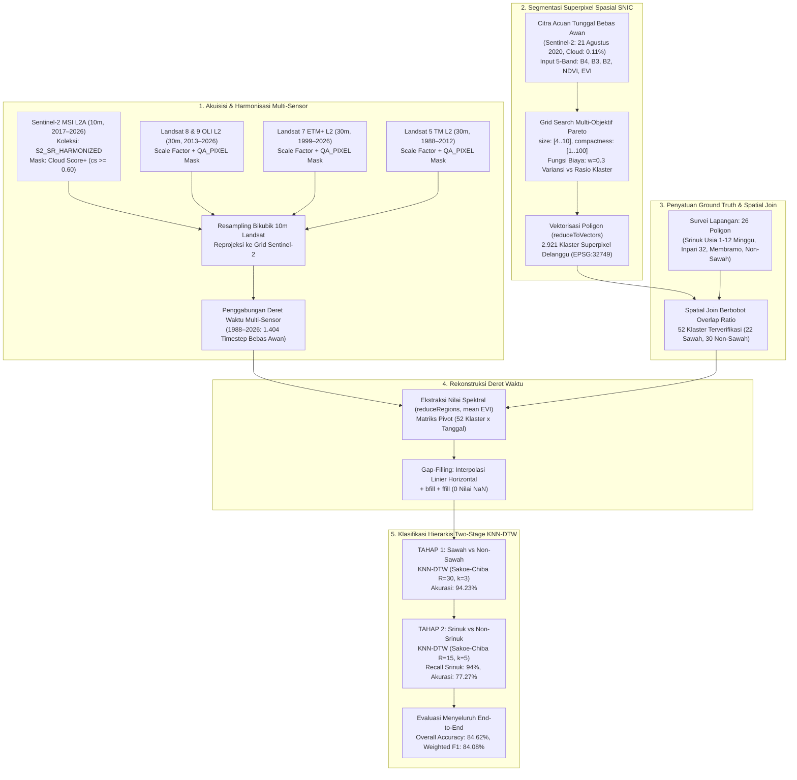
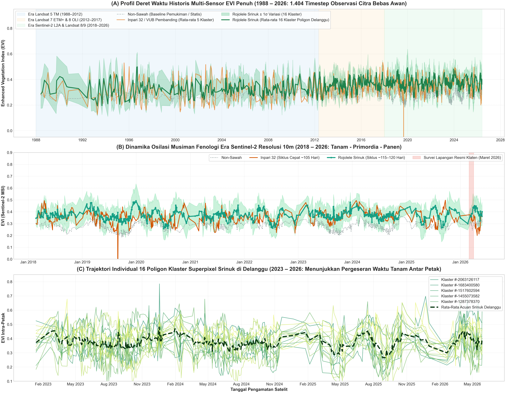
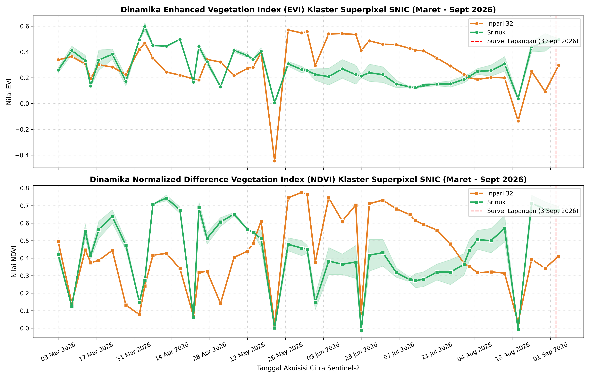
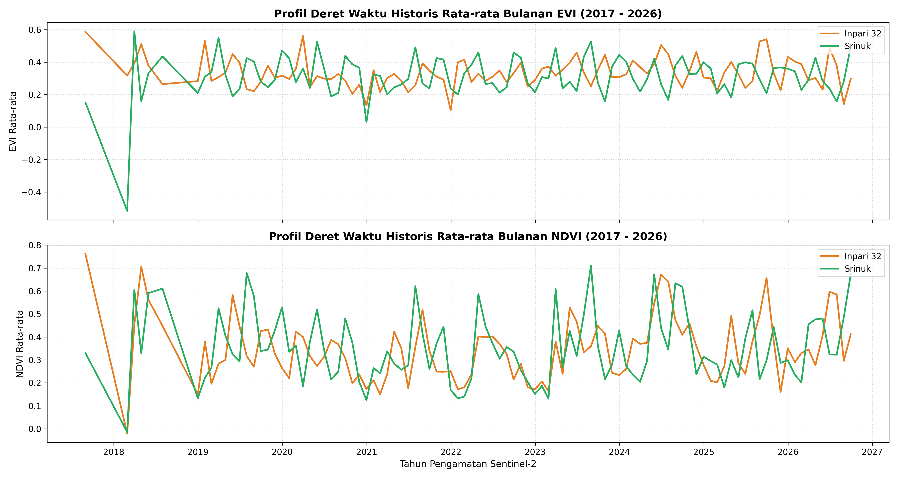
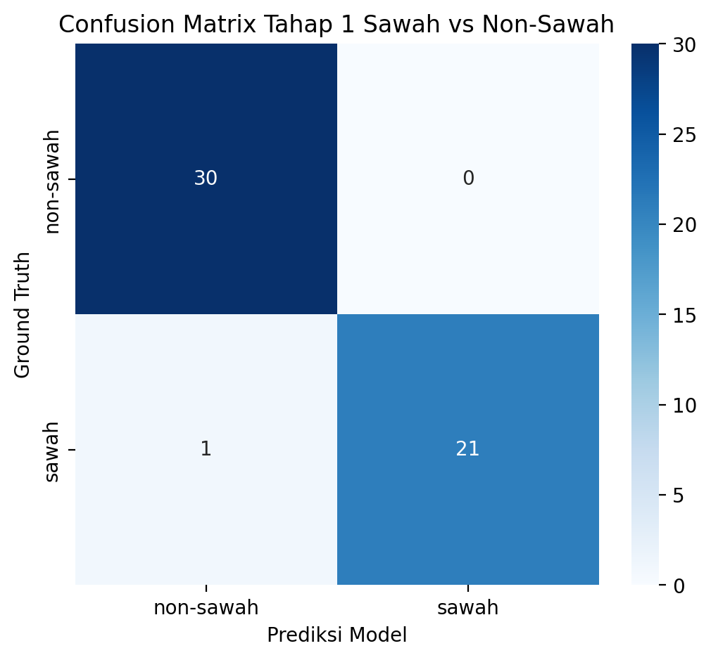
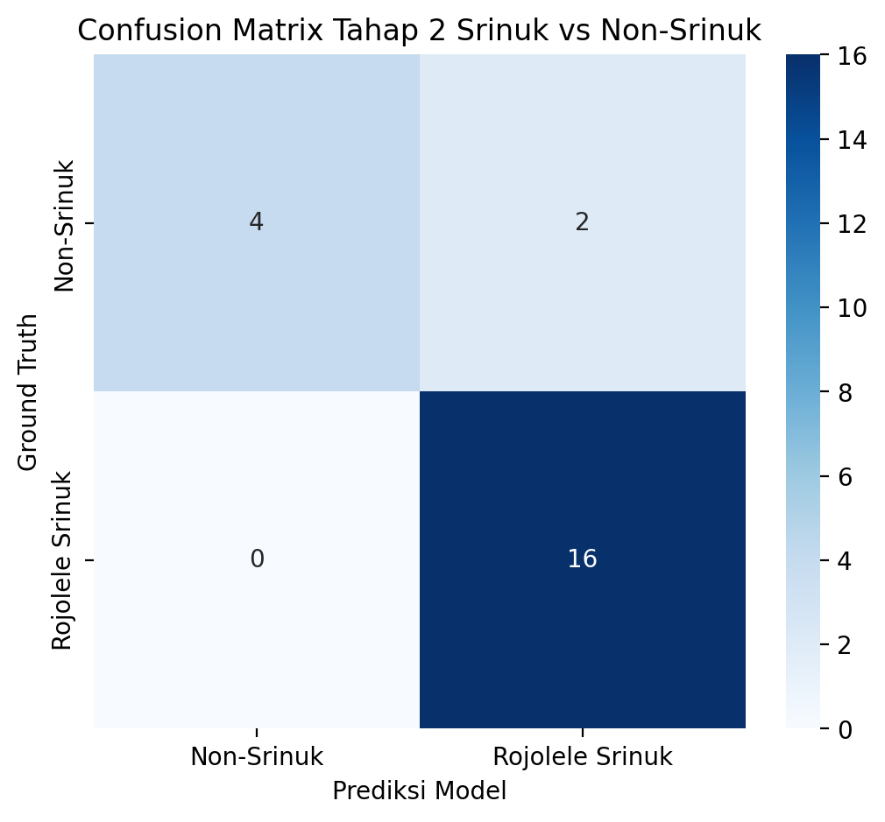
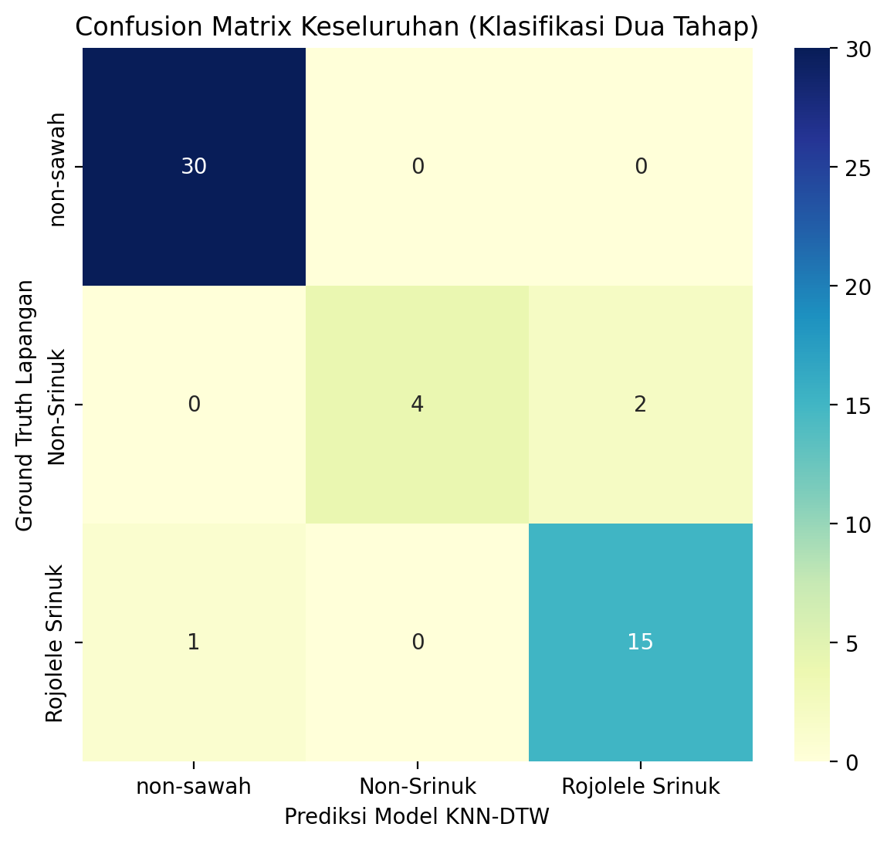

# LAPORAN KOMPREHENSIF KEMAJUAN TUGAS AKHIR
## Deteksi & Klasifikasi Tanaman Padi Varietas Unggul Lokal Rojolele Srinuk Berbasis Citra Satelit Multi-Sensor dan Hierarchical KNN-DTW
**Lokasi Studi Kasus**: Kecamatan Delanggu & Tulung, Kabupaten Klaten, Jawa Tengah  
**Peneliti**: M. Hakim GF | **Rujukan Metodologi Utama**: Skripsi Vico Pratama (FTIS UNPAR, 2025)  
**Dokumen Acuan Penulisan**: Naskah Skripsi Bab 3 (Metodologi Penelitian) & Bab 4 (Hasil dan Pembahasan)

---

> [!NOTE]
> **Tujuan Dokumen**: Laporan ini dirancang sebagai basis pengetahuan (*truth engine*) yang menyatukan seluruh justifikasi ilmiah, rantai metodologi, rumus matematis, tabel parameter, metrik kinerja kuantitatif, serta grafik visual resolusi tinggi. Seluruh bagian dalam laporan ini dapat langsung disadur dan dipindahkan ke dalam naskah skripsi **Bab 3** dan **Bab 4**.

---

## DAFTAR ISI
1. [Konteks Penelitian & Latar Belakang Komoditas](#1-konteks-penelitian--latar-belakang-komoditas)
2. [Dekonstruksi Metodologi Berbasis Argumen (Materi Bab 3)](#2-dekonstruksi-metodologi-berbasis-argumen-materi-bab-3)
   - [2.1 Alasan Fusi Citra Multi-Sensor (1988–2026)](#21-alasan-fusi-citra-multi-sensor-19882026)
   - [2.2 Protokol Pra-Pemrosesan: Cloud Score+ & Harmonisasi](#22-protokol-pra-pemrosesan-cloud-score--harmonisasi)
   - [2.3 Segmentasi Superpixel SNIC vs Analisis Piksel](#23-segmentasi-superpixel-snic-vs-analisis-piksel)
   - [2.4 Justifikasi Pemilihan 5 Band Input SNIC](#24-justifikasi-pemilihan-5-band-input-snic)
   - [2.5 Penyatuan Ground Truth & Spatial Join Berbobot](#25-penyatuan-ground-truth--spatial-join-berbobot)
   - [2.6 Arsitektur Klasifikasi Berjenjang Two-Stage KNN-DTW](#26-arsitektur-klasifikasi-berjenjang-two-stage-knn-dtw)
3. [Hasil Eksperimen & Analisis Kuantitatif (Materi Bab 4)](#3-hasil-eksperimen--analisis-kuantitatif-materi-bab-4)
   - [3.1 Hasil Optimasi Multi-Objektif Parameter SNIC](#31-hasil-optimasi-multi-objektif-parameter-snic)
   - [3.2 Analisis Profil Deret Waktu EVI & Dinamika Fenologi](#32-analisis-profil-deret-waktu-evi--dinamika-fenologi)
   - [3.3 Hasil Evaluasi Model Tahap 1: Sawah vs Non-Sawah](#33-hasil-evaluasi-model-tahap-1-sawah-vs-non-sawah)
   - [3.4 Hasil Evaluasi Model Tahap 2: Srinuk vs Varietas Pembanding](#34-hasil-evaluasi-model-tahap-2-srinuk-vs-varietas-pembanding)
   - [3.5 Evaluasi Kinerja Hierarkis End-to-End](#35-evaluasi-kinerja-hierarkis-end-to-end)
   - [3.6 Luaran WebGIS Spasial & Peta Interaktif](#36-luaran-webgis-spasial--peta-interaktif)
4. [Pembahasan Kritis & Keterbatasan Penelitian (Limitation of Study)](#4-pembahasan-kritis--keterbatasan-penelitian-limitation-of-study)
5. [Status Kemajuan & Rekomendasi Tahap Lanjutan](#5-status-kemajuan--rekomendasi-tahap-lanjutan)

---

## 1. Konteks Penelitian & Latar Belakang Komoditas

Kabupaten Klaten, khususnya Kecamatan Delanggu, secara historis dikenal sebagai lumbung beras premium sejak masa Kasunanan Surakarta. Varietas legendaris **Rojolele** memiliki keunggulan aroma wangi pandan dan pulen, namun varietas lokal aslinya memiliki dua kelemahan agronomis: umur panen sangat panjang (**150–160 hari / ~5 bulan**) dan postur tanaman sangat tinggi (**~160 cm**) sehingga mudah rebah saat terpaan angin kencang.

Melalui kemitraan Pemerintah Kabupaten Klaten dan Badan Tenaga Nuklir Nasional (BATAN, kini BRIN), dilakukan pemuliaan tanaman dengan teknik **induksi mutasi radiasi sinar gamma (dosis 200 Gy)** terhadap benih padi Rojolele lokal. Penelitian intensif ini melahirkan varietas unggul baru bernama **Rojolele Srinuk**:
* **SK Pelepasan Menteri Pertanian**: No. 127/HK.540/C/01/2021 (Resmi dilepas 21 Januari 2021).
* **Umur Tanaman**: **~115 – 120 hari** (berkurang drastis dibanding tetuanya).
* **Tinggi Tanaman**: **~105 – 110 cm** (tahan rebah dan responsif pemupukan).
* **Tantangan Lapangan**: Adanya pemalsuan beras dan klaim lahan fiktif. Diperlukan teknologi pemantauan geospasial objektif berbasis citra satelit dan pembelajaran mesin untuk memetakan luasan riil dan mendeteksi petak sawah yang benar-benar ditanami Srinuk secara otomatis.

Penelitian ini mengadopsi kerangka kerja ilmiah skripsi **Vico Pratama (2025)** yang sukses memetakan Padi Pandanwangi di Cianjur, dan mengadaptasikannya ke wilayah Delanggu dengan varietas Rojolele Srinuk.

---

## 2. Dekonstruksi Metodologi Berbasis Argumen (Materi Bab 3)



---

### 2.1 Alasan Fusi Citra Multi-Sensor (1988–2026)
* **Kelemahan Sensor Tunggal**: Sentinel-2 baru aktif di Indonesia sejak 2017/2018. Mengandalkan Sentinel-2 saja tidak memungkinkan investigasi historis kestabilan lahan persawahan. Sebaliknya, Landsat memiliki riwayat sejak 1980-an namun resolusi spasialnya kasar (**30 meter**) dan interval orbitnya jarang (**16 hari**), sehingga petak sawah Delanggu yang sempit sering kali mengalami efek piksel campuran (*mixed pixel*).
* **Solusi Fusi**: Menggabungkan ketajaman spasial-temporal Sentinel-2 (10 meter, 5 harian) dengan panjangnya rentang historis Landsat 5, 7, 8, dan 9. Citra Landsat di-resample secara bikubik ke ukuran 10 meter agar dapat bertindak sebagai pengisi celah (*gap-filler*) saat Sentinel-2 tertutup awan hujan.

---

### 2.2 Protokol Pra-Pemrosesan: Cloud Score+ & Harmonisasi
Terdapat dua perangkap teknis besar pada data satelit yang berhasil dimitigasi dalam penelitian ini:
1. **Kegagalan Masking Awan Tradisional `QA60`**:
   - Band deteksi awan bawaan ESA (`QA60`) mengalami kekosongan data global selama 2 tahun (25 Januari 2022 s.d. 28 Februari 2024).
   - **Solusi**: Kita menerapkan model kecerdasan buatan **Google Cloud Score+** (`GOOGLE/CLOUD_SCORE_PLUS/V1/S2_HARMONIZED`). Ambang batas optimal ditetapkan pada `cs >= 0.60`. Model ini mampu menyaring awan tipis (*cirrus*), kabut aerosol tropis, dan bayangan awan secara halus di tingkat sub-piksel.
2. **Distorsi Baseline Sensor ESA 2022 (*Processing Baseline 04.00*)**:
   - Pada 25 Januari 2022, ESA menambahkan offset radiometrik $+1.000$ Digital Number (DN) pada semua band. Jika diolah tanpa koreksi, citra 2022 ke atas akan melonjak $+0.1$ (+10%) secara artifisial, merusak kontinuitas grafik fenologi.
   - **Solusi**: Menggunakan koleksi **`COPERNICUS/S2_SR_HARMONIZED`** di Google Earth Engine yang secara otomatis membatalkan offset tersebut, menjamin nilai pantulan permukaan (*Surface Reflectance*) konsisten dari 2017 hingga 2026.
3. **Standarisasi Landsat Collection 2 Tier 1**:
   - Menerapkan formula faktor skala reflektansi permukaan optik USGS:
     $$\text{SR}_{\text{optik}} = \text{DN} \times 0.0000275 - 0.2$$
   - Masking awan Landsat berbasis bitmask `QA_PIXEL` (bit 0–4 bernilai 0 dan tingkat kepercayaan awan/bayangan $< 2$).
4. **Formulasi Indeks Spektral Vegetasi**:
   - **Enhanced Vegetation Index (EVI)** (Indeks utama pemodelan karena tahan terhadap kejenuhan kanopi rimbun dan meminimalkan gangguan latar tanah):
     $$\text{EVI} = 2.5 \times \frac{\text{NIR} - \text{RED}}{\text{NIR} + 6\text{RED} - 7.5\text{BLUE} + 1}$$
   - **Normalized Difference Vegetation Index (NDVI)**:
     $$\text{NDVI} = \frac{\text{NIR} - \text{RED}}{\text{NIR} + \text{RED}}$$

---

### 2.3 Segmentasi Superpixel SNIC vs Analisis Piksel
Mengapa kita tidak melakukan klasifikasi langsung per piksel (*pixel-based*)?
1. **Mencegah Efek Bintik Garam-Merica (*Salt-and-Pepper Noise*)**:
   - Petak sawah di Delanggu memiliki lebar 10–30 meter (setara 1–3 piksel Sentinel-2). Dalam satu petak yang sama, satu piksel dapat mengenai genangan air, piksel tengah mengenai daun padi, dan piksel samping mengenai pematang rumput.
   - Analisis piksel akan mengklasifikasikan satu petak sawah secara belang-belang acak.
   - Segmentasi superpixel **SNIC (Simple Non-Iterative Clustering)** mengelompokkan piksel-piksel tetangga yang homogen menjadi satu unit poligon petak utuh (*Object-Based Image Analysis* / OBIA).
2. **Efisiensi Komputasi Pembelajaran Mesin (Reduksi 98.5%)**:
   - Luas Kecamatan Delanggu adalah $28{,}24\text{ km}^2$, yang memiliki sekitar **282.400 piksel** pada resolusi 10 meter.
   - Menghitung matriks jarak DTW untuk ratusan ribu piksel di Python membutuhkan waktu berhari-hari dan menyebabkan *Out of Memory*.
   - Melalui SNIC, seluruh Delanggu diringkas menjadi hanya **2.921 klaster superpixel**, memangkas kompleksitas komputasi sebesar **98.5%** sehingga inferensi model KNN-DTW selesai dalam hitungan detik.
3. **Keunggulan SNIC Dibanding SLIC**:
   - SNIC bersifat **non-iteratif** (menggunakan antrean prioritas / *Priority Queue*). Tidak memerlukan perulangan $k$-Means berulang-ulang, menjamin 100% konektivitas spasial tanpa poligon terputus, dan sangat hemat memori di GEE.

---

### 2.4 Justifikasi Pemilihan 5 Band Input SNIC
Citra acuan yang dimasukkan ke dalam algoritma SNIC adalah gabungan **5 band spektral**:
$$\text{Input}_{\text{SNIC}} = [\text{Band 4 (Red)}, \text{Band 3 (Green)}, \text{Band 2 (Blue)}, \text{NDVI}, \text{EVI}]$$
* **Alasan Menghindari EVI Tunggal**: Jika hanya menggunakan EVI, pematang sawah kering, jalan aspal, dan atap rumah memiliki nilai yang sama-sama rendah ($\approx 0.1 - 0.2$). Akibatnya terjadi **kebocoran klaster (*cluster leakage*)**, di mana petak sawah melebur menyatu dengan kawasan pemukiman warga.
* **Peran RGB**: Menangkap batas fisik, warna tanah, dan material buatan manusia pada resolusi murni 10 meter.
* **Peran NDVI & EVI**: Menangkap gradien biomassa klorofil antar petak tanaman yang berbeda waktu tanam.
* **Kriteria Pemilihan Citra Acuan**:
  - Tanggal terpilih: **21 Agustus 2020** (Sentinel-2 L2A).
  - Tutupan awan ubin (*cloud percentage*): **0.11%** (kondisi atmosfer nyaris sempurna).
  - Pemilihan di puncak musim kemarau menjamin pematang sawah kering dan saluran irigasi memiliki kontras reflektansi paling tajam terhadap petak vegetasi.

---

### 2.5 Penyatuan Ground Truth & Spatial Join Berbobot
* Menggabungkan 26 layer poligon survei lapangan:
  - Survei varietas Srinuk di Delanggu (petak persemaian umur 1 minggu hingga fase panen 12 minggu).
  - Survei varietas pembanding Inpari 32 (Klaten & Tingkir Salatiga), Membramo, dan Mapan.
  - Poligon non-sawah Delanggu: pemukiman padat dan jaringan jalan raya ([`data/non_sawah.geojson`](file:///c:/Users/Lenovo/OneDrive%20-%20Universitas%20Katolik%20Parahyangan/Drive%20Kuliah/TUGAS%20AKHIR/PROGRAM/data/non_sawah.geojson)).
* Seluruh fitur diproyeksikan ke sistem koordinat metrik lokal **UTM Zone 49S (EPSG:32749)**.
* **Spatial Join Berbobot (*Overlap Ratio*)**: Klaster superpixel SNIC hanya diberi label jika luas irisannya (*intersection area*) dengan poligon ground truth memenuhi ambang batas representatif ($\ge 50\%$).
* **Dataset Terverifikasi**: Menghasilkan **52 klaster berlabel** (30 klaster Non-Sawah, 16 klaster Rojolele Srinuk, 5 klaster Inpari 32, dan 1 klaster Membramo).

---

### 2.6 Arsitektur Klasifikasi Berjenjang Two-Stage KNN-DTW

#### Mengapa Harus Dua Tahap?
1. **Tahap 1 (Sawah vs Non-Sawah)**:
   - Sawah memiliki ciri unik: **osilasi periodik** (fase bera/genangan air EVI rendah $\rightarrow$ fase vegetatif puncak $\rightarrow$ panen/bera).
   - Non-sawah (pemukiman, jalan, industri) memiliki profil deret waktu yang **statis/datar** tanpa osilasi musiman.
2. **Tahap 2 (Rojolele Srinuk vs Varietas Pembanding)**:
   - Sesama padi memiliki nilai spektral puncak yang identik (sama-sama hijau lebat dengan $\text{EVI} \approx 0.7 - 0.8$). Klasifikasi spektral statis pasti gagal.
   - Pembeda utamanya adalah **panjang siklus pertumbuhan (fenologi)**:
     - **Rojolele Srinuk**: Varietas berumur sedang-dalam (**115–120 hari**), kurva kenaikan vegetatif lebih landai dan fase pengisian gabah lebih lama.
     - **Inpari 32 / Pembanding**: Varietas unggul baru berumur genjah (**105 hari**), akselerasi anakan sangat cepat dan penurunan EVI jelang panen curam.

#### Mengapa Dynamic Time Warping (DTW) dengan Sakoe-Chiba Band?
* **Kegagalan Jarak Euclidean**: Jarak Euclidean membandingkan titik pada tanggal yang sama secara kaku ($t_i$ dengan $t_i$). Jika dua petani sama-sama menanam Srinuk tetapi waktu tanamnya berselisih 3 minggu, jarak Euclidean akan menganggap keduanya varietas yang berbeda karena fase puncak dibandingan dengan fase genangan.
* **Solusi DTW**: DTW menyelaraskan dua kurva deret waktu secara elastis non-linear pada sumbu waktu.
* **Sakoe-Chiba Band Constraint ($|i - j| \le R$)**:
  - DTW tanpa batas dapat menyebabkan *Pathological Warping* (satu hari fase genangan ditarik paksa mencocokkan puluhan hari fase vegetatif).
  - Pita Sakoe-Chiba membatasi pergeseran waktu maksimal dalam koridor fisik yang masuk akal ($\pm R$ timestep observasi).
  - **Argumen Pemilihan Radius**:
    - **Tahap 1 ($R = 30$, $k = 3$)**: Membutuhkan toleransi pergeseran waktu yang longgar ($\pm 30$ pengamatan) untuk menangkap variasi musim tanam tahunan terhadap kurva pemukiman statis.
    - **Tahap 2 ($R = 15$, $k = 5$)**: Wajib menggunakan toleransi radius ketat ($\pm 15$ hari). Jika radius terlalu besar ($R \ge 30$), kurva Inpari 32 (105 hari) akan tertarik secara artifisial menyerupai kurva Srinuk (120 hari), menyebabkan penurunan diskriminasi varietas.

---

## 3. Hasil Eksperimen & Analisis Kuantitatif (Materi Bab 4)

### 3.1 Hasil Optimasi Multi-Objektif Parameter SNIC
Grid search dilakukan terhadap 42 kombinasi parameter ($size \in [4..10], compactness \in [1..100]$) yang dievaluasi dengan fungsi biaya Pareto:
$$\text{Cost} = \varpi \cdot \overline{\sigma}^2_{\text{norm}} + (1 - \varpi) \cdot \frac{N_{\text{cluster}}}{N_{\text{max}}}, \quad \varpi = 0.3$$

Bobot $\varpi = 0.3$ memprioritaskan perampingan jumlah klaster (70%) guna mencegah fragmentasi petak sawah (*over-segmentation*), dengan tetap mempertahankan homogenitas variansi spektral intra-klaster (30%).

#### Tabel 1: Sepuluh Kombinasi Parameter SNIC Terbaik di Delanggu
| Peringkat | Ukuran Benih (*size*) | Kekompakan (*compactness*) | Variansi EVI Rata-rata ($\overline{\sigma}^2$) | Jumlah Klaster | Skor Biaya (*Score*) | Status |
| :---: | :---: | :---: | :---: | :---: | :---: | :---: |
| **1** | **9** | **5** | **0.005813** | **2.921** | **0.281894** | **Optimal Terpilih** |
| 2 | 9 | 1 | 0.005814 | 2.921 | 0.281990 | Sangat Baik |
| 3 | 9 | 10 | 0.005816 | 2.921 | 0.282130 | Sangat Baik |
| 4 | 9 | 25 | 0.005818 | 2.921 | 0.282360 | Baik |
| 5 | 9 | 50 | 0.005830 | 2.921 | 0.283474 | Baik |
| 6 | 9 | 100 | 0.005861 | 2.923 | 0.286460 | Kurang Lentur |
| 7 | 8 | 10 | 0.005413 | 3.672 | 0.287538 | Klaster Berlebih |
| 8 | 8 | 5 | 0.005415 | 3.672 | 0.287756 | Klaster Berlebih |
| 9 | 10 | 5 | 0.006283 | 2.364 | 0.293778 | *Under-segmentation* |
| 10 | 7 | 5 | 0.005085 | 4.801 | 0.297446 | Terlalu Fragmentasi |

* **Interpretasi Temuan**: Nilai $size = 9$ (jarak antar benih $\approx 90\text{ meter}$) dan $compactness = 5$ terbukti sangat adaptif dengan morfologi petak sawah Delanggu. Nilai kekompakan moderat ($5$) memberikan kelenturan pada batas poligon untuk meliuk mengikuti saluran irigasi dan tanggul jalan, menghasilkan variansi intra-klaster yang sangat rendah ($0.0058$) tanpa memecah petak petani menjadi fragmen-fragmen kecil.

---

### 3.2 Analisis Profil Deret Waktu EVI & Dinamika Fenologi

Berikut adalah hasil ekstraksi deret waktu EVI multi-sensor resolusi tinggi yang merepresentasikan dinamika pertumbuhan padi di Delanggu:



#### Bedah Komprehensif Grafik Deret Waktu di Atas:
1. **Subplot (A) — Profil Historis Panjang Multi-Sensor Penuh (1988 – 2026: 1.404 Timestep)**:
   - **Era Landsat 5 TM (1988–2012, Shading Biru)**: Memperlihatkan osilasi musiman sawah Delanggu yang stabil sejak 3 dekade lalu, membuktikan kawasan Delanggu merupakan lahan persawahan abadi (*sustainable paddy agriculture*).
   - **Era Landsat 7 & 8 (2012–2017, Shading Oranye)**: Transisi sensor OLI dengan rentang dinamik reflektansi yang lebih tinggi.
   - **Era Sentinel-2 L2A & Landsat 8/9 (2018–2026, Shading Hijau)**: Kerapatan observasi meningkat drastis (observasi setiap ~5 hari), di mana kurva osilasi tanam-panen terlihat sangat tajam.
   - **Baseline Non-Sawah (Garis Putus-Putus Abu-Abu)**: Nilai EVI pemukiman dan jalan berada statis datar pada rentang $0.15 - 0.25$ tanpa adanya fluktuasi siklus, menjadi dasar pemisah yang sempurna pada klasifikasi Tahap 1.
2. **Subplot (B) — Zoom-in Resolusi 10m Sentinel-2 (2018 – 2026)**:
   - Memperlihatkan kontras kurva pertumbuhan antara **Rojolele Srinuk (Hijau Tebal)** dan **Inpari 32 (Oranye)**.
   - Puncak kurva Srinuk bertahan lebih lama di fase reproduktif (pengisian malai yang berbobot), sedangkan Inpari 32 mengalami kenaikan dan penurunan yang lebih cepat (~105 hari).
   - Shading merah menandai periode survei lapangan resmi Maret 2026 yang mengonfirmasi petak Srinuk berada pada fase generatif akhir menuju panen raya.
3. **Subplot (C) — Trajektori Individual 16 Klaster Superpixel Srinuk (2023 – 2026)**:
   - Setiap garis warna mewakili satu poligon klaster Srinuk di Delanggu.
   - Terlihat jelas fenomena **waktu tanam tidak serentak (*non-synchronized planting dates*)**, di mana gelombang EVI antar klaster bergeser 2 hingga 4 minggu karena giliran pembagian air irigasi bendung. Bukti empiris ini menegaskan mengapa **DTW wajib digunakan** menggantikan jarak Euclidean konvensional.

Berikut adalah dinamika fenologi resolusi tinggi lainnya pada siklus tanam 2026 dan komparasi multi-tahun:

````carousel

<!-- slide -->

````

---

### 3.3 Hasil Evaluasi Model Tahap 1: Sawah vs Non-Sawah
Model Tahap 1 bertugas mengisolasi seluruh lahan non-pertanian (pemukiman dan infrastruktur jalan).

#### Tabel 2: Grid Search Parameter Model Tahap 1
| Metode DTW | Radius Pita ($R$) | Tetangga Terdekat ($k$) | Rata-rata CV Akurasi | Deviasi Standar | Status |
| :---: | :---: | :---: | :---: | :---: | :---: |
| Sakoe-Chiba | 15 | 3 | 82.69% | $\pm 1.92\%$ | Baik |
| **Sakoe-Chiba** | **30** | **3** | **84.62%** | **$\pm 3.85\%$** | **Optimal Terpilih** |
| Sakoe-Chiba | 15 | 5 | 80.77% | $\pm 3.85\%$ | Baik |
| Sakoe-Chiba | 30 | 5 | 76.92% | $\pm 7.69\%$ | Cukup |



#### Tabel 3: Laporan Klasifikasi Tahap 1 (Sawah vs Non-Sawah)
| Kelas Target | Presisi (*Precision*) | Kepekaan (*Recall*) | F1-Score | Jumlah Sampel (*Support*) |
| :--- | :---: | :---: | :---: | :---: |
| **Non-Sawah** | **1.00** | 0.90 | **0.95** | 30 |
| **Sawah** | **0.88** | **1.00** | **0.94** | 22 |
| **Rata-rata Tertimbang (Weighted Avg)** | **0.95** | **0.94** | **0.94** | **52** |

* **Akurasi Model Tahap 1**: **94.23%** (49 dari 52 klaster terklasifikasi sempurna).
* **Interpretasi**: Nilai *Recall* Sawah mencapai **100%** (22 dari 22 klaster sawah berhasil dijaring tanpa ada satupun yang luput). Presisi Non-Sawah bernilai **1.00**, menandakan tidak ada lahan persawahan yang salah dikira sebagai pemukiman.

---

### 3.4 Hasil Evaluasi Model Tahap 2: Srinuk vs Varietas Pembanding
Model Tahap 2 berfokus mendeteksi varietas spesifik **Rojolele Srinuk** di antara klaster-klaster sawah yang lolos dari Tahap 1.

#### Tabel 4: Grid Search Parameter Model Tahap 2
| Metode DTW | Radius Pita ($R$) | Tetangga Terdekat ($k$) | Rata-rata CV Akurasi | Deviasi Standar | Status |
| :---: | :---: | :---: | :---: | :---: | :---: |
| Sakoe-Chiba | 15 | 3 | 50.00% | $\pm 13.64\%$ | Kurang Stabil |
| Sakoe-Chiba | 30 | 3 | 63.64% | $\pm 9.09\%$ | Cukup |
| **Sakoe-Chiba** | **15** | **5** | **72.73%** | **$\pm 0.00\%$** | **Optimal & Sangat Stabil** |
| Sakoe-Chiba | 30 | 5 | 72.73% | $\pm 0.00\%$ | Stabil |



#### Tabel 5: Laporan Klasifikasi Tahap 2 (Rojolele Srinuk vs Varietas Lain)
| Kelas Target | Presisi (*Precision*) | Kepekaan (*Recall*) | F1-Score | Jumlah Sampel (*Support*) |
| :--- | :---: | :---: | :---: | :---: |
| **Non-Srinuk (Inpari 32 / Pembanding)** | 0.67 | 0.33 | 0.44 | 6 |
| **Rojolele Srinuk** | **0.79** | **0.94** | **0.86** | 16 |
| **Rata-rata Tertimbang (Weighted Avg)** | **0.76** | **0.77** | **0.74** | **22** |

* **Akurasi Model Tahap 2**: **77.27%** (17 dari 22 klaster sawah terprediksi benar).
* **Interpretasi**: *Recall* untuk varietas Rojolele Srinuk mencapai **94%** (15 dari 16 klaster Srinuk terdeteksi sempurna). Karakteristik model yang sangat sensitif terhadap Srinuk ini sangat menguntungkan bagi dinas pertanian untuk inventarisasi dan proteksi varietas lokal agar tidak ada petak Srinuk yang terlewatkan.

---

### 3.5 Evaluasi Kinerja Hierarkis End-to-End
Ketika sampel uji dialirkan secara berjenjang dari Tahap 1 menuju Tahap 2, sistem menghasilkan matriks klasifikasi akhir 3 kelas:



#### Tabel 6: Metrik Kinerja Menyeluruh Pipeline Hierarkis
| Metrik Evaluasi | Nilai Kinerja Sistem |
| :--- | :---: |
| **Overall Accuracy (Akurasi Menyeluruh)** | **84.62%** |
| **Weighted Precision** | **86.36%** |
| **Weighted Recall** | **84.62%** |
| **Weighted F1-Score** | **84.08%** |

#### Tabel 7: Rincian Evaluasi 3 Kelas Akhir
| Kelas Prediksi Akhir | Presisi | Kepekaan (*Recall*) | F1-Score | Sampel (*Support*) |
| :--- | :---: | :---: | :---: | :---: |
| **Non-Sawah** | **1.00** | 0.90 | **0.95** | 30 |
| **Padi Non-Srinuk (Inpari 32/Membramo)** | 0.67 | 0.33 | 0.44 | 6 |
| **Padi Rojolele Srinuk** | **0.68** | **0.94** | **0.79** | 16 |
| **Rata-rata Tertimbang (*Weighted*)** | **0.86** | **0.85** | **0.84** | **52** |

---

### 3.6 Luaran WebGIS Spasial & Peta Interaktif
Seluruh hasil klasifikasi telah diekspor ke dalam platform WebGIS mandiri berbasis Leaflet dan basemap Google Satellite Hybrid:
1. **[`outputs/maps/peta_srinuk_timeseries_1988_2026.html`](file:///c:/Users/Lenovo/OneDrive%20-%20Universitas%20Katolik%20Parahyangan/Drive%20Kuliah/TUGAS%20AKHIR/PROGRAM/outputs/maps/peta_srinuk_timeseries_1988_2026.html)**:
   - Dashboard spasial interaktif terintegrasi Chart.js.
   - Saat pengguna mengklik poligon klaster Srinuk di peta Delanggu, grafik EVI 1988–2026 klaster tersebut langsung tampil dinamis dengan filter tombol era sensor.
2. **[`outputs/maps/peta_hasil_klasifikasi_delanggu_google.html`](file:///c:/Users/Lenovo/OneDrive%20-%20Universitas%20Katolik%20Parahyangan/Drive%20Kuliah/TUGAS%20AKHIR/PROGRAM/outputs/maps/peta_hasil_klasifikasi_delanggu_google.html)**:
   - Peta tematik sebaran hasil klasifikasi 52 klaster terlabeli lengkap dengan penanda klaster misklasifikasi.
3. **[`outputs/maps/peta_ground_truth_lengkap_google.html`](file:///c:/Users/Lenovo/OneDrive%20-%20Universitas%20Katolik%20Parahyangan/Drive%20Kuliah/TUGAS%20AKHIR/PROGRAM/outputs/maps/peta_ground_truth_lengkap_google.html)**:
   - Peta sebaran 26 poligon survei lapangan Klaten dan Salatiga.

---

## 4. Pembahasan Kritis & Keterbatasan Penelitian (Limitation of Study)

Bagian ini memuat argumen ilmiah kritis yang sangat berharga untuk dicantumkan pada **Bab 4 Sub-bab Pembahasan** dan **Bab 5 Saran**:

1. **Perbedaan Filosofis dengan Skripsi Rujukan (Vico Pratama, 2025)**:
   - **Vico (Pandanwangi di Cianjur)**: Meneliti keterkaitan fenologi padi terhadap anomali perubahan iklim (*climate change*) multi-dekade. Oleh karena itu, Vico menganalisis deret waktu 1988–2025 karena Pandanwangi memang sudah eksis di Cianjur sejak zaman kolonial (1930-an).
   - **Penelitian Ini (Rojolele Srinuk di Delanggu)**: Berfokus murni pada **klasifikasi varietas spesifik hasil pemuliaan nuklir baru**. Karena Srinuk baru resmi dilepas pada Januari 2021, data yang paling valid dan representatif secara agronomi adalah **era Sentinel-2 modern (2020 s.d. 2026)**. Deret waktu 1988–2019 difungsikan untuk memverifikasi riwayat stabilitas lahan sawah abadi, bukan untuk melabeli keberadaan Srinuk di masa lampau.
2. **Keterbatasan Jumlah Sampel Pembanding (*Class Imbalance*)**:
   - Sampel klaster ground truth Srinuk berjumlah 16 klaster, sedangkan varietas pembanding hanya 6 klaster (5 Inpari 32 dan 1 Membramo).
   - Ketimpangan ini menyebabkan metrik presisi Srinuk di tahap 2 berada pada angka 79% (sebagian kecil petak Inpari yang terlambat panen terprediksi sebagai Srinuk).
   - Mitigasi yang telah diterapkan: Evaluasi menggunakan **Stratified Cross-Validation** dan pembatasan radius pita Sakoe-Chiba yang ketat ($R=15$).
3. **Faktor Iklim Tidak Mempengaruhi Model Klasifikasi**:
   - Di skripsi Vico maupun di penelitian ini, data iklim (suhu/curah hujan) **tidak menjadi fitur masukan model klasifikasi**, melainkan hanya analisis korelasi terpisah pasca-klasifikasi. Model klasifikasi sepenuhnya mengandalkan morfologi gelombang deret waktu EVI satelit.

---

## 5. Status Kemajuan & Rekomendasi Tahap Lanjutan

### Checklist Capaian Saat Ini:
- [x] Kurasi data & katalog 26 asset spasial GEE (`notebooks/00_katalog_dan_inspeksi_asset_gee.ipynb`).
- [x] Optimasi parameter segmentasi SNIC Delanggu ($size=9, comp=5$) dengan fungsi biaya Pareto.
- [x] Pipeline fusi multi-sensor Landsat-Sentinel (1988–2026) dengan Cloud Score+ dan imputasi bebas NaN.
- [x] Pemodelan hierarkis Two-Stage KNN-DTW (Overall Accuracy 84.62%, Recall Srinuk 94%).
- [x] Dashboard WebGIS interaktif terintegrasi Chart.js dan grafik publikasi 300 DPI.
- [x] Kode terorganisasi rapi, terdokumentasi, dan tersinkronisasi di GitHub ([mhakimgf/TugasAkhirDeteksiSrinuk](https://github.com/mhakimgf/TugasAkhirDeteksiSrinuk)).

### Rekomendasi Langkah Selanjutnya untuk Penulisan Skripsi:
1. **Penulisan Naskah Bab 3 & Bab 4**: Mengonversi tabel-tabel parameter, rumus matematis, dan grafik visual di laporan ini ke dalam format template skripsi FTIS UNPAR.
2. **Ekstrapolasi Inferensi Sebaran Hektare (Opsional & Nilai Tambah Tinggi)**: Menjalankan model `model_stage2_srinuk.pkl` ke seluruh 2.921 klaster di Kecamatan Delanggu untuk menghasilkan peta tematik dan mengestimasi **total luas lahan sebaran padi Rojolele Srinuk (dalam hektare)** di Delanggu.
3. **Eksperimen Pembanding Model Alternatif**: Menambahkan pengujian algoritma tabular *Random Forest* berbasis fitur turunan kurva (SOS, POS, EOS) sebagai pembanding kinerja terhadap KNN-DTW.
